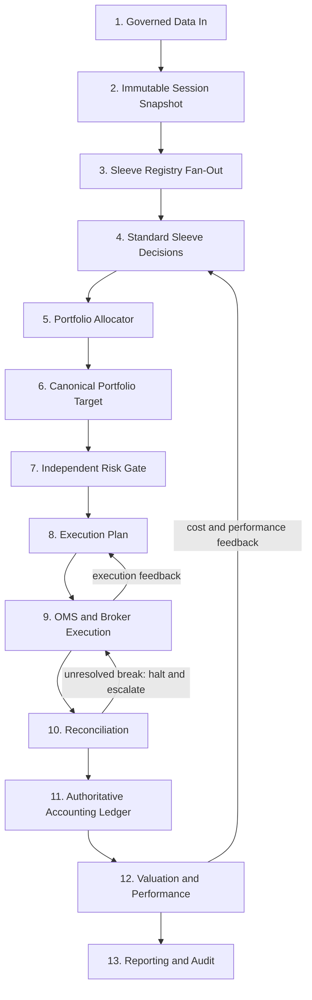

# Caerus Operating System Reference

## Purpose

This is the entry point for the Caerus source-of-truth document set. Once
ratified by the owner, every strategy, implementation, review, and operational
conversation must begin here.

The current classification of every document family is maintained in
[`DOCUMENTATION_STATUS_REGISTER.md`](DOCUMENTATION_STATUS_REGISTER.md).

It does not replace detailed contracts. It defines which documents and machine
artifacts control a question, how conflicts are resolved, and the one
end-to-end operating model Caerus is building toward. It exists to prevent
architecture and governance drift.

## Non-negotiable operating model

Caerus operates one straight-through, attributable portfolio process:



The detailed, as-built contract for this flow is
[`docs/architecture/caerus_as_built_data_flow.md`](architecture/caerus_as_built_data_flow.md).
No alternative execution path, target-construction path, accounting path, or
reporting fallback may be introduced without an explicit amendment to that
contract and this reference.

## Migration implementation status

The generic deployment-and-accounting migration is in advisory contract
implementation, not operational activation. The detailed status and dependency
order are maintained in
[`generic_deployment_accounting_migration_plan.md`](architecture/generic_deployment_accounting_migration_plan.md).

As of 2026-08-18, isolated contracts exist for governed lane deployment,
owner decisions, standard sleeve outputs and legacy-evaluation adapters,
registry/deployment-bound research allocation inputs, lane allocation and
targets, independent Risk review, advisory exact plans and off-by-default plan
persistence, reconciliation-bound target attainment, a broker-incapable
Paper/Live execution safety dry run, explicit read-only broker-evidence
normalization, submission-disabled OMS/WAL, generic reconciliation,
attributable fill and non-fill accounting, deployment-scoped FIFO cost basis,
valuation and performance, lifecycle recommendations, durable unsent owner
workflow/outbox and dry-run activation, off-by-default factual reporting-input
persistence, and truth-safe reporting plus a fallback-free dashboard consumer.
The owner-directed tranche also adds a frozen-Orion fixture/capture contract,
a strategy-neutral dual-compute parity harness, a preregistered Shadow-only
adaptive allocator, and one shared generic Paper/Live environment-adapter and
cutover-preflight contract. Off-by-default runners now expose Orion fixture
recovery, adaptive-Shadow readiness, and a no-submit generic scheduler; generic
Live policy, rollback, environment, and runbook templates remain disarmed.
Every new execution or activation artifact explicitly grants no authority.
The immutable owner directive
[`owner_directive_2026-08-18_generic_lane_migration.json`](governance/decision_records/owner_directive_2026-08-18_generic_lane_migration.json)
now resolves how the prior PAPER-baseline ambiguity is handled: generic PAPER
is `NOT_YET_CUT_OVER`, the legacy runtime must remain unchanged, Orion is used
only as a frozen legacy PAPER comparison fixture, and local Lyra edits remain
candidate state rather than authority. The directive also makes adaptive
allocation required migration scope, beginning in Shadow. None of these
contracts changes the active registry, activates adaptive allocation in Paper,
submits orders, changes broker state, or allocates capital.

The remaining gating work includes authoritative production cutover of the
broker/execution binding, activation of scheduled factual-history publication,
external owner-notification delivery, switching the existing dashboard to the
truth-only consumer, adaptive-allocation Shadow evidence, and staged
operational rollout. The disabled scheduled-v2, accounting/reporting/history,
dashboard-consumer, and owner-outbox paths are now implemented and observed;
they grant no production authority. Live may
be re-enabled only at a verified generic
lane cutover in which Paper and Live share the same target, Risk, safety, OMS,
reconciliation, accounting, and reporting contracts. The legacy Live executor
is explicitly unauthorized. Until those gates pass, the as-built runtime and
recorded owner decisions remain authoritative.

The first repository-only Orion capture status is sealed at
[`orion_legacy_paper_fixture_capture_status_20260818.json`](baselines/orion_legacy_paper_fixture_capture_status_20260818.json).
It records the initial `BLOCKED` local search. A later read-only VM capture
recovered a complete 2026-08-18 same-session decision, broker state, target,
exact-plan, and intended-order chain. The frozen factual input is sealed at
[`orion_legacy_paper_factual_fixture_20260818.json`](baselines/orion_legacy_paper_factual_fixture_20260818.json),
with byte-level VM provenance at
[`orion_legacy_paper_factual_vm_sources_20260818.json`](baselines/orion_legacy_paper_factual_vm_sources_20260818.json).
This makes the legacy factual comparison input `READY`; it is not yet a
generic-path parity result and grants no deployment, execution, or activation
authority.
The factual generic advisory replay is separately sealed at
[`orion_generic_factual_replay_20260818.json`](baselines/orion_generic_factual_replay_20260818.json).
It completes standard decision v2, allocation, target, Risk, and exact plan v4.
Target parity is exact, but order parity is `REVIEW_REQUIRED`: generic v4 adds
an LRCX sale and omits the legacy WDC buy because strict per-symbol flooring
differs from the legacy nearest-feasible whole-share planner. Generic PAPER
remains `NOT_YET_CUT_OVER`, active PAPER is unchanged, and the artifact grants
no execution or activation authority.
That mismatch record is preserved. The corrected replay is separately sealed
at
[`orion_generic_factual_replay_cash_aware_20260818.json`](baselines/orion_generic_factual_replay_cash_aware_20260818.json).
It uses a deterministic, proof-bounded cash-aware whole-share realization and
achieves `EXACT_PARITY` for both target and orders: sell two INTC at $97.15 and
buy one WDC at $514.91. Projected cash is $568.53, $1.57725 below the 5% target
and within the governed $7.0921 tolerance; cash remains positive and every
order cap, quantity precision, collar, fee assumption, and sleeve contribution
is hash-bound. This closes factual planner parity but still grants no PAPER or
Live cutover, execution, or activation authority.
A distinct corrected replay at
[`orion_generic_factual_replay_cash_aware_20260818.json`](baselines/orion_generic_factual_replay_cash_aware_20260818.json)
preserves that initial mismatch as evidence while adding a governed,
proof-bounded cash-aware whole-share realization. The corrected result is
`EXACT_PARITY`: SELL two INTC at $97.15 and BUY one WDC at $514.91, with
projected cash $568.53 inside the explicit $7.0921 cash-target tolerance and
above the hard cash floor. This resolves parity for the captured session only;
it does not cut over generic PAPER or grant execution or activation authority.
The strongest reproducible substitute available locally is sealed at
[`orion_legacy_synthetic_replay_20260812.json`](baselines/orion_legacy_synthetic_replay_20260812.json).
It proves that the committed pure Orion plan fixture is structurally
reproducible, but it is labeled `SYNTHETIC_REPLAY` and must never be presented
as historical broker evidence, factual parity, return evidence, or a target.
The corresponding adaptive-Shadow readiness manifest is
[`adaptive_shadow_evidence_readiness_20260818.json`](baselines/adaptive_shadow_evidence_readiness_20260818.json).
That historical capture was `BLOCKED` before an owner policy decision. The
owner has now approved candidate hash `0ee486...` for Shadow observation only
in
[`adaptive_shadow_v1_owner_approval_20260818.json`](governance/decision_records/adaptive_shadow_v1_owner_approval_20260818.json).
The enabled readiness result at
[`adaptive_shadow_v1_activation_readiness_20260818.json`](baselines/adaptive_shadow_v1_activation_readiness_20260818.json)
still fails closed to static Polaris because deployment membership, decision
v2, causal signals, readiness history, and constraint evidence are absent.

The local working tree contains candidate registry edits that are incompatible
with committed Orion-bound legacy execution tests. It is not a deployable
legacy-runtime source. Do not infer authority from that dirty registry or
rewrite historical fixtures to make it appear authoritative; deployment must
use an immutable owner decision and hash-bound policy artifact.

Read-only VM evidence is sealed at
[`generic_live_vm_preflight_2026-08-18.json`](evidence/generic_live_vm_preflight_2026-08-18.json).
That historical capture found a clean checkout, structurally disabled legacy
Live, and generic staging roots. It was `READY_TO_STAGE`, not ready to trade,
and records no remote mutation.

The no-submit observation closure is now staged in an isolated VM checkout,
not the active runtime. The sealed record is
[`generic_live_no_submit_staging_deployment_2026-08-18.json`](evidence/generic_live_no_submit_staging_deployment_2026-08-18.json):
branch `codex/generic-live-no-submit-staging-20260818`, commit `13f07fdd...`,
41 focused tests passing, scheduler default `DISABLED_NO_ACTION`, and active
checkout/config/cron/kill switch/broker unchanged.

A second isolated observation deployment adds the disabled production-facing
consumption path. Its sealed record is
[`generic_live_disabled_consumption_staging_deployment_2026-08-18.json`](evidence/generic_live_disabled_consumption_staging_deployment_2026-08-18.json):
code commit `9af8ea9433d763cba3b61820d3a9291d7fe4dac6`, evidence commit
`e6e489494c6e37d9f897080a290d630e6cc425c3`, 103 VM observation tests,
and six explicit no-action proofs. The shared generic Paper/Live rehearsal is
sealed at
[`generic_paper_live_no_write_rehearsal_2026-08-18.json`](evidence/generic_paper_live_no_write_rehearsal_2026-08-18.json)
and proves both lanes use the same adapter while performing no broker call or
write. Read-only Live evidence observed $460.90 equity and cash; the disabled,
account-hash-pinned candidate is capped at the owner-stated $460 and retains a
$100 minimum trade, one-order maximum, 95% gross cap, whole shares, long-only,
no leverage, and no shorting. Its preflight remains `BLOCKED` by exactly eight
active-cutover gates: active account pin, capital ceiling, and max-orders
configuration; active generic checkout and schedule; and owner, submission,
and schedule approvals. The kill switch remains armed.

The owner subsequently approved the exact Lyra-only Live v1 policy. The generic
source is now deployed and the reviewed disabled operating shell is installed.
The original source-only deployment remains sealed at
[`generic_live_v1_active_source_deployment_2026-08-19.json`](evidence/generic_live_v1_active_source_deployment_2026-08-19.json).
The current installed state is sealed separately at
[`generic_live_v1_disabled_installation_2026-08-19.json`](evidence/generic_live_v1_disabled_installation_2026-08-19.json),
content hash `bd056ac57670f31016adea140d9ed8951f832bb6ebb030d6028f47c91714aaca`.
Active `main` and its upstream are clean at
`2d12a3c86e27c175319b226e9ff745f197da71a8`; deploy validation passed
138 plus 35 tests and six operational checks. Independent review closed P0-2
through P0-7. The exact account-hash-pinned configuration is mode `0600`, has
the $460 ceiling, $100 minimum trade, one-order maximum, and effective session,
but submission approval, scheduling, and posttrade observation are all disabled.
The generic session gate and legacy kill switch remain armed. One date-bound
cron entry is installed and inert; its manual launch exits before the broker
boundary. Legacy environment and executor hashes and all PAPER hashes remain
unchanged, and no broker call, broker write, or order submission occurred.

Activation and submission remain `NO_GO` on the sole remaining P0:
`NO_EXECUTION_READY_FACTUAL_LYRA_CHAIN`. A fresh governed session must bind its
data and universe, produce factual Lyra v2 risk, capacity, and liquidity fields,
and compile an exact Lyra-only v4 plan before any schedule, observation, kill
switch, or submission setting may be enabled. Installed source or cron presence
must never be read as trading authority.

The 2026-08-19 session cannot satisfy that gate without changing Lyra's weekly
economics. Lyra's Wednesday target carries its Monday 2026-08-17 selection,
while the governed universe freeze is prospective only from 2026-08-19 and
forbids retroactive use. The immutable chronology verdict is
[`generic_live_v1_p0_1_chronology_no_go_2026-08-19.json`](evidence/generic_live_v1_p0_1_chronology_no_go_2026-08-19.json),
content hash `f1d8e172b5660c2d83120bb1bd30a0801e3a55e966ab214728fe0f6ef37b1ba1`.
The first eligible prospective signal/rebalance date is Monday 2026-08-24,
after its completed close. The first executable session is therefore Tuesday
2026-08-25, because Monday's 07:00 precompute still carries Friday data and the
inadmissible 2026-08-17 weekly target. The initial 2026-08-24 pending proposal
is preserved but superseded before owner action by
[`generic_live_v1_owner_decision_2026-08-24.supersession.json`](governance/proposals/generic_live_v1_owner_decision_2026-08-24.supersession.json),
content hash `2365872d053941a3f6565ced52c10505a787a8930df0d9aa82f21f1e6b25f3d2`.
The corrected same-terms owner proposal is
[`generic_live_v1_owner_decision_2026-08-25.pending.json`](governance/proposals/generic_live_v1_owner_decision_2026-08-25.pending.json),
content hash `c523bc96aae5e45688449750dd7fb995564958545972411f0510ed15cf434eeb`.
It is `PENDING_OWNER_APPROVAL` and grants no approval, activation, or execution
authority.

The decision-grade evidence formulas are governed separately rather than
silently inferred from implementation constants. The exact proposal is
[`lyra_governed_evidence_policy_v1.pending.json`](governance/proposals/lyra_governed_evidence_policy_v1.pending.json),
content hash `c6c12f954757f5ee020ff27e5c10705462a0a24a689c018290995c83de878e0e`.
It binds the 20-session risk and liquidity windows, 1% order and 5%
liquidation participation limits, $20 million minimum mean dollar volume,
20-times-capital capacity floor, XNYS calendar policy, and canonical full-L1
turnover. It is pending Brett's approval and cannot be used to mark a Lyra
decision READY until a separate immutable owner decision binds this exact
proposal.

The prospective Lyra v2 producer and all raw-source/owner-policy activation
bindings are now implemented, independently reviewed, and deployed as disabled
source at exact SHA `20743ad2b25217d0a236d10a0f64f0430288c744`. The sealed
deployment evidence is
[`generic_lyra_v2_source_deployment_2026-08-19.json`](evidence/generic_lyra_v2_source_deployment_2026-08-19.json),
content hash `507d7787d8e751343c8421c86f482b891e999b3bb3f1fd1cf71f228d8b66d377`.
This closes the implementation side of P0-1 only. The active generic config
still pins the earlier disabled SHA, so the mismatch is an additional
fail-closed barrier; submission, schedule, and posttrade flags remain zero and
both generic and legacy gates remain armed.

The separately reviewed, one-date advisory capture boundary is now deployed as
disabled source at exact SHA
`44987faf32f591b80fbf803d8e09f715dcef1970`. It fixes the signal at Monday
2026-08-24, the execution/capture session at Tuesday 2026-08-25, and the
earliest capture time at 08:15 America/New_York. Its disabled path reads no
capture inputs and writes nothing; its enabled path can write only immutable
advisory evidence and has no broker, submission, activation, or execution
authority. Deployment evidence is sealed at
[`governed_lyra_capture_boundary_source_deployment_2026-08-19.json`](evidence/governed_lyra_capture_boundary_source_deployment_2026-08-19.json),
content hash
`0888d46975915a861e5205a348f8be8abcab0e23273b3b831bc1d6d6bbb8deee`.
The exact disabled configuration and inert one-date capture cron are now
installed. The capture flag is literal `0`, so the scheduled wrapper exits
before reading any capture input or writing any artifact. Removal of the
capture-owned cron lines reproduces the pre-install crontab byte-for-byte;
PAPER and unrelated entries are unchanged. This installed state is sealed in
[`governed_lyra_capture_boundary_disabled_install_2026-08-19.json`](evidence/governed_lyra_capture_boundary_disabled_install_2026-08-19.json),
content hash
`07941e134f68251f5be9bc5b12812d863e83080023cf415767657c098fbc30d1`.
Enabling capture is not owner approval and still requires the exact policy and
session owner artifacts named above. Live remains disabled and armed.

On 2026-08-19 Brett superseded the fixed-$460 Live candidate with a cash-only
dynamic-capital policy. The immutable owner record is
[`generic_live_v1_dynamic_balance_owner_decision_20260824.json`](governance/decision_records/generic_live_v1_dynamic_balance_owner_decision_20260824.json),
content hash
`abc334ba680afe4b9ae50ce815ad2f591a842931f8c3a12b797e2fdadc58b506`.
It sets no nominal dollar ceiling: gross capacity is 95% of fresh factual
broker net-liquidation equity, while new buys are separately limited by fresh
settled cash proven from complete fresh order and fill history after subtracting
T+1-unsettled sell proceeds, with zero pending transfers and a 5% equity cash
reserve. The broker account `cash` field is explicitly not treated as settled
cash. Buying power,
margin multipliers, borrowing, unsettled proceeds, and unverified pending
funds are forbidden. Deposits affect limits only after they appear in factual
net equity and the complete-history settled-cash proof; withdrawals and losses
reduce limits automatically. The record lists and supersedes every named fixed-cap candidate,
proposal, owner decision, installation, and activation-preflight hash. It
grants no execution or activation authority by itself, and PAPER is unchanged.

The requested Monday 2026-08-24 session remains chronologically incapable of a
same-session decision under canonical Lyra economics. Monday's 07:00 precompute
has completed data only through Friday 2026-08-21; the first post-freeze weekly
Lyra target is selected only after Monday's close and can first execute Tuesday
2026-08-25. The sealed rehearsal
[`generic_live_v1_dynamic_monday_rehearsal_20260824.json`](evidence/generic_live_v1_dynamic_monday_rehearsal_20260824.json),
content hash
`6950ac3f5b5b51b020bd453e92c20e4e93dcdf1134056c810cc12e62410a1756`,
therefore concludes `BLOCKED_NO_TRADE_REARMED`: no order, broker call, schedule
enable, or kill-switch change is authorized. Using Monday as an executing
session would require a separate owner decision to change Lyra's weekly
economics; otherwise Tuesday requires a session-specific owner decision.

The corrected dynamic contracts remain source-only and non-authoritative until
independent review. They require raw byte-bound account evidence, complete
paginated order and fill sources, exact order/fill reconciliation, an externally
pinned owner hash, a dynamic no-ceiling capital-policy hash, and an independently
pinned current broker fee schedule. Missing history, stale bytes, an untrusted
fee schedule, or a fixed-capital plan fails closed before any authority exists.

Independent review approved exact source `9497bd51e287696819a5fe151ee358334fe40cd7`
for source-only deployment. It is now active on the VM with 52 focused tests
green and a clean checkout. The pre/post generic config, legacy env, and
crontab hashes are identical; the generic gate remains `ARMED` and submit,
schedule, and posttrade flags remain zero. The sealed deployment evidence is
[`generic_live_dynamic_source_deployment_2026-08-19.json`](evidence/generic_live_dynamic_source_deployment_2026-08-19.json),
content hash `d4354e2ab1a45d1b23ef46c17d6fd865fd86d67fe1ae01b956142e0f09d42dcf`.
The dynamic config is deliberately not installed because its reviewed fee
schedule hash is still unresolved. This deployment grants no runtime or
activation authority.

A concrete conservative adaptive policy is proposed at
[`adaptive_shadow_v1_policy_candidate.json`](governance/proposals/adaptive_shadow_v1_policy_candidate.json),
with its owner brief at
[`ADAPTIVE_SHADOW_V1_DECISION_BRIEF.md`](governance/proposals/ADAPTIVE_SHADOW_V1_DECISION_BRIEF.md).
The exact candidate hash is approved for Shadow observation only. Its separate
activation readiness remains blocked with static Polaris as the modeled
control. No Paper/Live, execution, promotion, or automatic recovery authority
was granted.

## Canonical source hierarchy

Use the narrowest authoritative source that answers the question. A lower item
cannot override a higher item.

| Priority | Source | Authority |
|---:|---|---|
| 0 | Explicit owner decision, recorded in a decision record | Strategy promotion/retirement, lane deployment, capital and risk posture |
| 1 | `config/research/strategy_registry.json` and governed deployment policy | Machine-readable current sleeve and lane configuration |
| 2 | `docs/architecture/caerus_as_built_data_flow.md` | End-to-end system and accounting contract |
| 3 | `docs/governance/caerus_investment_doctrine.md` | Investment and portfolio-construction principles |
| 4 | `docs/governance/CURRENT_RESEARCH_ROADMAP.md` and `docs/governance/fr_registry.md` | Current research state, priorities, and FR status |
| 5 | Hash-bound session, execution, reconciliation, ledger, valuation, and audit artifacts | What actually happened for a stated date and lane |
| 6 | Dashboard, emails, summaries, and narrative reports | Presentation only; never authority over the inputs above |

If authoritative sources disagree, classify the discrepancy as a **source
conflict**. Do not silently choose one, relabel a result, or change code to make
the conflict disappear. Record the conflict, identify the owner of the
resolution, and fail closed where execution, accounting, or promotion is
affected.

The controlling migration decision as of 2026-08-18 is the hash-bound owner
directive named above. It records generic PAPER as `NOT_YET_CUT_OVER`, grants
neither Lyra candidate edits nor the Orion fixture active generic authority,
requires adaptive allocation to prove itself in Shadow first, and authorizes a future Live
kill-switch disengagement only as part of an owner-approved, fully verified
generic cutover. It grants neither execution nor activation authority by
itself.

## Lane and lifecycle policy

The system has separate lanes: `shadow`, `paper`, and `live`. A sleeve may
generate an observation in more than one lane only when explicitly configured
for each. Each deployed lane must declare its sleeve set, capital cap, risk
budget, effective date, and rollback version.

The daily allocator may optimize only among sleeves already approved for its
lane. It must use the approved objective and constraints, including evidence
quality, risk, concentration, overlap, turnover, liquidity/capacity, and cost.
It must not promote a sleeve, retire a sleeve, increase a live cap, or chase the
most recent return on its own.

Lifecycle changes use a separate owner-controlled loop:

```text
factual and modeled evidence
  -> system recommendation (promote, retain, deprecate, or hold)
  -> owner approval or rejection
  -> versioned lane-deployment policy
  -> next eligible immutable session
```

An approval is a specific, auditable configuration decision. It must state the
sleeve, source lane, destination lane, capital cap, effective session, risk
limits, and rollback action. Rejection changes nothing. The system may make a
recommendation; only the owner changes a sleeve's lifecycle or live capital.

## Performance truth

Performance claims must always state their surface:

| Surface | Meaning | Permitted label |
|---|---|---|
| Shadow NAV | Modeled target-weight performance | `modeled shadow return` |
| Paper ledger | Executed paper fills, cash, fees, and marks | `realized paper return` |
| Live ledger | Executed live fills, cash, fees, and marks | `realized live return` |

Shadow results are useful research evidence but are never retroactively treated
as paper or live performance. A paper or live sleeve begins its factual return
series at the first reconciled fill for its deployment version. Every factual
return must trace through the accounting ledger to order/fill, position, cash,
fee, and valuation evidence at one explicit as-of time.

## Required artifacts and identities

The following identifiers must survive stages 2 through 13:

```text
session_id + lane_id + sleeve_id + deployment_version + decision_id
  + allocation_id + target_hash + execution_plan_id + broker_order_id + fill_id
```

These identifiers are required to attribute economic results accurately when
multiple sleeves share an account. An account-level broker balance without this
lineage is factual account data, but it is not factual sleeve-level P&L.

## Change discipline

Before any material proposal or implementation, state:

1. The numbered operating-model stage or stages affected.
2. The authoritative input and output artifacts.
3. Whether the change is operational or strategic.
4. Whether an owner decision is required.
5. The exact documents, configuration, tests, and rollback path that must
   change together.

No task may create a parallel architecture, policy, strategy specification, or
performance definition. Amend the relevant canonical document and record the
decision instead.

## Required reading by task type

| Task | Read first |
|---|---|
| Any Caerus task | This reference and `docs/governance/ORCHESTRATOR_CONTEXT.md` |
| Strategy, promotion, retirement, or allocation | Doctrine, roadmap, registry, relevant decision record |
| Execution, reconciliation, ledger, valuation, or dashboard | As-built data-flow contract and relevant runbook/contract |
| Runtime fact or incident | Hash-bound artifacts for the specified date and lane, then the as-built contract |
| Documentation or architecture | This reference, canonical hierarchy, and affected canonical document |

## Ratification and amendment

This draft becomes canonical only when Brett records a ratification decision.
After ratification, amend it only through a dated owner decision record that
names the changed section, reason, implementation artifacts, validation, and
rollback. Historical decisions remain immutable.
