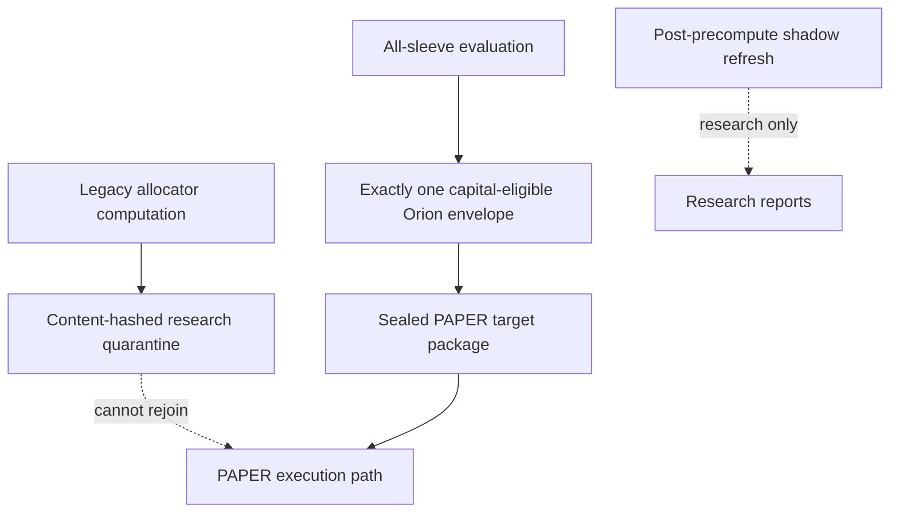
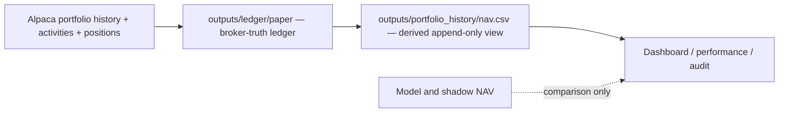

# Caerus as-built data flow and authority line

**Current as-built:** 2026-08-14, after the owner-approved authority migration
**Execution scope:** PAPER only; live remains blocked

## Executive conclusion

Caerus now has one straight PAPER decision line. Orion is selected once during
precompute from the current or immediately preceding XNYS session. That target
is sealed as an immutable Decision hash. The 09:35 workflow consumes that exact
Decision object, adds fresh broker/market state, permits Risk only to reduce the
target, produces exact whole-share orders mechanically, submits them, and then
records and audits broker truth.

The legacy daily allocator still runs because it supplies research and market
state evidence. Its signals and proposed trades are moved under a content-hashed
`research/growth_engine_v4/` directory and explicitly have no execution
authority. They never rejoin the PAPER path.

```mermaid
flowchart LR
  I["Data in: prices, universe, research, registry, prior broker evidence"]
  O["Observation: sleeve evaluations + dated market state"]
  D["Decision: one sealed Orion target hash"]
  R["09:35 Risk: fresh broker/market state; may only reduce"]
  T["Trader: exact whole-share transition plan"]
  B["Alpaca PAPER: submit and fill"]
  C["Record: run-local results + broker-truth ledger"]
  A["Audit: equality, reconciliation, health, target attainment"]
  I --> O --> D --> R --> T --> B --> C --> A
```

## Schedule and ownership

| ET | Stage | Sole authority | Output |
|---|---|---|---|
| 06:30 | Research inputs | Evidence only | Research digest |
| 06:45 | Security master | Evidence only | Dated security master |
| 07:00 | Precompute and seal | Decision | `paper_target_package.json` and one `approved_target_hash` |
| 09:35 | Exact planning/execution | Risk then Trader | Immutable exact plan, intended/submitted orders, broker results |
| 10:00 | Confirmation | Audit/read-only | Canonical selected run and operator email |
| 18:30 | Price/shadow refresh | Research only | Shadow observations; never PAPER authority |
| 19:15 | Broker-truth pull | Accounting truth | `outputs/ledger/paper/daily_nav.csv` and broker ledger |
| 19:45 | Canonical history | Derived accounting view | `outputs/portfolio_history/nav.csv` from broker ledger only |
| 21:00 | Shadow CIO report | Research only | Comparative research report |

## The precompute bundle

`outputs/precompute/<trade-date>/` contains five execution-path members:

| Artifact | Meaning | May create orders? |
|---|---|---:|
| `daily_snapshot.json` | Dated market-state observation | No |
| `sleeve_evaluations.json` | Complete registry evaluation and sole Orion source selection | No |
| `paper_target_package.json` | Immutable Evidence + Decision packages and target hash | Target authority only |
| `signals.json` | Exact projection of the sealed Decision target | No independent authority |
| `planned_execution_payload.json` | Handoff pointing to the same target hash; exact orders explicitly deferred | No |
| `contract.json` | Completion marker and SHA-256 manifest for all five members | Gate only |

The contract schema is version 2 and declares
`authority_model: orion_single_sealed_target_v1`. Every canonical projection
must carry the Decision package's `approved_target_hash`. Any missing file,
hash mismatch, target mismatch, source change, stale session, strategy identity
mismatch, or pre-open exact trade list fails closed.

## Why there can appear to be two precomputes

There are two computations, but only one is a PAPER decision:

1. `daily_quant_report.py` computes the legacy multi-sleeve research frame and
   dated market observations.
2. The sleeve control plane evaluates every registered non-frozen sleeve and
   identifies the one capital authority, Orion.

The seal step makes the boundary explicit. The legacy frame is retained at:

`outputs/precompute/<date>/research/growth_engine_v4/precompute-<hash>/`

It is immutable evidence with `execution_authority: false`. The selected Orion
snapshot is converted into the only canonical target files. The later shadow
refresh is research/reporting and cannot alter that morning seal.

## 09:35 execution invariants

- The builder does not resolve the shadow directory or choose current versus
  prior Orion again.
- It rehydrates the exact pre-open Evidence and Decision packages and verifies
  the bundle file hashes.
- The target symbols, weights, cash target, and Decision hash must match the
  sealed package exactly.
- Risk can remove/reduce a target or increase cash; it cannot invent a symbol,
  increase a Decision weight, reverse a side, or lower Decision cash.
- Trader receives the hash-bound Risk package and mechanically prices the
  target against fresh broker holdings, cash, quotes, open orders, and market
  session state.
- The exact authorizer rejects a plan whose Decision hash or sealed target file
  hash differs from precompute.
- The executor accepts only the immutable exact plan; precompute has
  `precompute_execution_authority: false`.

## Record and audit line

The execution run remains run-local and append-only: exact plan, intended
orders, submission WAL, broker order IDs, fills, expected state, actual state,
economic reconciliation, equality gate, execution health, and the canonical
selection pointer all retain their existing fail-closed behavior.

Actual PAPER NAV now has one source:

`live_overlay_nav_series.csv`, `nav_timeseries.csv`, and shadow NAV remain valid
research/comparison surfaces but can no longer silently populate canonical
actual PAPER NAV. If the broker ledger is unavailable, canonical history emits
a warning/freshness escalation and uses no model fallback.

## Operator proof for a trading day

The shortest proof is:

1. `contract.json` is schema 2 and bundle validation is `OK`.
2. `approved_target_hash` is identical in the contract, target package,
   signals, precompute handoff, 09:35 plan, and persisted Decision package.
3. The exact plan binds the sealed target file hash and Decision hash.
4. Intended orders equal submitted orders; all broker orders reach terminal
   states; reconciliation and execution health are green.
5. Nightly canonical NAV identifies
   `outputs/ledger/paper/daily_nav.csv` as its source.

No successful 2026-08-14 evidence is rewritten by this migration. The deployed
code governs the next precompute/execution cycle; any attempted use of an old
schema-1 bundle in the PAPER cron lane triggers one self-heal rebuild and then
fails closed if a valid seal cannot be produced.
