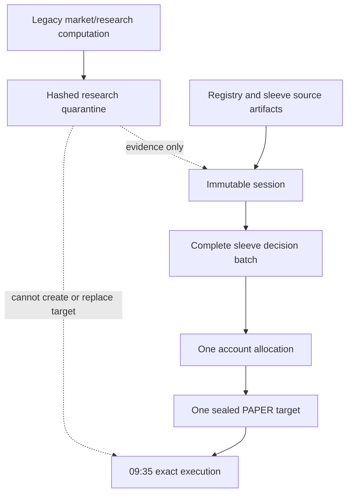

# Caerus institutional portfolio operating model

**As built:** 2026-08-14 owner-approved migration

**Contract scope:** Orion Alpaca PAPER lane only. This document does not model
or negate the separately governed Lyra Live portfolio; see
`docs/CURRENT_OPERATING_STATE.md`.

**Current capital allocation:** 100% of sleeve risk budget to Caerus Orion, with
5% account cash target

**This Orion PAPER contract:** no Live authority; options execution blocked.
Lyra Live is active under its separate owner decision and runtime controls.

## Executive conclusion

Caerus has one portfolio operating line:

```text
data -> session -> sleeve decisions -> allocation -> risk -> exact execution
     -> broker reconciliation -> causal ownership -> valuation -> audit/reporting
```

There is one morning session, one terminal decision for every registered
non-frozen sleeve, one configured account allocator, one exact order package,
one broker-truth reconciliation, and one explicit reporting as-of. A downstream
component cannot replace the strategy, reconstruct a target from signals, or
assign P&L to a sleeve without causal execution evidence.

Orion is the only capital sleeve in the current registry policy. That is a
configuration fact, not a single-sleeve architecture: adding a governed capital
sleeve requires a complete registry/policy change but no alternate precompute,
allocator, executor, ledger, or report.


## Authority by stage

| Stage | Authority | Contract and output | Failure posture |
|---|---|---|---|
| Data admission | Session builder | `session_manifest.json`: paths, hashes, freshness, one session ID | Missing, changed, or stale required input fails the seal |
| Sleeve assessment | Registry control plane | `sleeve_decisions.json`: exactly one `RECOMMENDATION`, `NO_TRADE`, `UNAVAILABLE`, `FROZEN`, or `OBSERVATION` outcome per expected sleeve | Coverage mismatch fails; stale sources are `UNAVAILABLE`, never silently carried |
| Portfolio construction | Configured risk-budget allocator | `portfolio_allocation.json`: account targets plus decision-bound sleeve contributions | Capital set must exactly equal policy set; an unavailable positive-budget sleeve fails closed |
| Decision seal | PAPER target authority | `paper_target_package.json` and `audit_manifest.json` | Any identity, target, source, or hash mismatch fails closed |
| Risk | Existing independent Risk package | Hash-bound risk decision; may reduce exposure or increase cash | Cannot add a symbol, increase a target, reverse a side, or lower required cash |
| Trader | Exact-plan authorizer | Immutable `caerus.execution_plan.v3`, including session, allocation, and sleeve contribution lineage | Cannot rebuild from signals or use a recovery target |
| Broker | Unified PAPER executor | Intent, write-ahead submission record, Alpaca order IDs, fills, terminal state | Ambiguous post-submit failures are not automatically retried |
| Reconciliation | Execution and broker truth | Intended = submitted; orders terminal; expected positions = broker positions | Divergence prevents success and top-level green |
| Ownership | Causal ledger | Broker order ID -> client order ID -> exact order -> allocation -> sleeve decision | A post-cutover unmatched fill fails; pre-cutover fills remain `legacy_unattributed` |
| Valuation | Broker snapshots | One `valuation_latest.json` with account and positions at the same `pulled_at_utc` | Equity must reconcile to cash plus positions within 1 bp (minimum $0.01) |
| Reporting/audit | Scheduled portfolio history and daily audit | One reporting snapshot/as-of and `portfolio_audit.json` | Mixed dates, stale NAV, degraded reporting, or broken lineage suppress the report |

## What “precompute” means now

The scheduled 07:00 job still invokes the historical daily quant program to
collect market/research evidence. Its old proposed signals and trades are
quarantined under:

`outputs/precompute/<date>/research/growth_engine_v4/precompute-<hash>/`

That directory is immutable research evidence and has
`execution_authority: false`. It is not a second target and cannot rejoin the
capital path.

The same 07:00 job then runs the actual portfolio precompute:

1. Admit dated inputs into one immutable session.
2. Fan out over the registry and produce one terminal sleeve decision for every
   non-frozen sleeve.
3. Apply the configured capital risk budgets once at the account level.
4. Net overlapping symbols while retaining every contributing sleeve decision
   ID and hash.
5. Seal all projections and their hashes into contract schema 3.

`outputs/precompute/<trade-date>/` therefore has these canonical members:

| Artifact | Purpose |
|---|---|
| `daily_snapshot.json` | Dated observation; proposed trades removed |
| `sleeve_evaluations.json` | Complete registry dispatch evidence |
| `session_manifest.json` | Immutable admitted-input set |
| `sleeve_decisions.json` | Complete standardized daily decisions |
| `portfolio_allocation.json` | Sole account-level target and causal contributions |
| `paper_target_package.json` | Sealed Evidence and Decision authority |
| `signals.json` | Read-only projection of the sealed target |
| `planned_execution_payload.json` | Hash-bound handoff; exact orders deferred to 09:35 |
| `audit_manifest.json` | Hash manifest across the full decision chain |
| `contract.json` | Schema-3 completion gate and file-hash map |

The apparent “multiple precomputes” problem is therefore removed at the
authority boundary: one legacy research computation remains as evidence, but
only the registry allocator produces a PAPER target.



## Multiple sleeves

The allocator is deliberately portfolio-level. If Orion and Lyra were both
approved for capital, governance would update the registry so that:

- both are capital-eligible and PAPER-execution-eligible;
- both appear in `sleeve_risk_budgets`, which must sum to 1.0;
- the capital-eligible set, execution-eligible set, and budget set match
  exactly; and
- the account cash and target-attainment policies remain explicit.

The allocator then scales each sleeve target by its risk budget and by the
account investable weight, nets shared tickers, and records both causal claims.
The exact plan uses the portfolio identity `caerus_paper_portfolio`; buys inherit
the allocator contributions, and sells consume actual causal inventory
proportionally. No new lane is created.

There is no automatic promotion. A newly registered research or shadow sleeve
continues to generate observations but receives no capital until the owner
approves the complete policy change.

## Options and other instruments

Options remain disabled in both scheduled submission flags. They must not be
added through a second options submitter. To become eligible, an instrument
adapter must first implement the same straight line end to end:

1. canonical contract identity (underlying, expiry, strike, call/put,
   multiplier and asset class);
2. sleeve target and allocator semantics in exposure/risk units;
3. independent limits for liquidity, Greeks, concentration, expiry and exercise;
4. exact-plan and write-ahead submission support;
5. broker fill, assignment/exercise and position reconciliation; and
6. causal ownership and mark-to-market valuation at the same reporting as-of.

Only after those contracts and failure tests exist may an options sleeve be
enabled by governance. The portfolio line stays the same; only the instrument
adapter changes.

## Scheduled operating day

| ET | Job | Canonical result |
|---|---|---|
| 06:30–07:00 | Research, security master, precompute | Immutable session, full decisions, one allocation and seal |
| 09:35 | PAPER execution heartbeat | Exact risk-authorized transition, submission and reconciliation |
| 10:00 | Confirmation | Selected terminal run and operator communication |
| 18:30 | Price/shadow refresh | Research observations; stale data publishes no new `latest` and makes health non-green |
| 19:15 | Broker ledger | Fills, orders, positions, account snapshot, causal ownership and valuation |
| 19:45 | Portfolio history and daily audit | Strict same-day/same-as-of reporting snapshot and portfolio audit |
| 21:00 | Shadow CIO report | Research comparison only |

## End-to-end proof for a day

A trading day is complete only when all of the following are true:

1. Contract schema 3 validates every declared file hash.
2. The session covers all required inputs and the sleeve batch covers the full
   expected non-frozen registry.
3. The capital set equals the configured risk-budget set and every positive
   budget sleeve produced a recommendation.
4. The sealed target, exact plan, and submitted orders carry the same session,
   allocation, decisions and target hashes.
5. Intended orders equal submitted orders, all broker orders are terminal, and
   expected positions reconcile to broker positions.
6. Every post-cutover fill has exact-plan lineage; broker quantities equal the
   sum of causal ownership quantities.
7. Account equity equals cash plus broker-valued positions and all reporting
   sources share one explicit `as_of`.
8. `outputs/audit/<date>/portfolio_audit.json` is `PASS`.

Historical fills are never rewritten. Transactions before the first
allocator-bound exact plan are explicitly `legacy_unattributed`; causal sleeve
performance begins at the cutover rather than assigning past P&L to a strategy
that cannot be proven to have caused it.

## Architectural invariants after the migration

| Invariant | Enforced result |
|---|---|
| Every non-frozen sleeve generates a daily decision | Complete registry fan-out and coverage equality |
| Every executable order traces to a sleeve decision | Session/allocation/decision hashes and per-order contributions |
| No strategy can be silently substituted downstream | Recovery targets rejected; legacy planner quarantined |
| Provenance survives every transformation | Preserved through target, exact order, broker fill, ownership and valuation |
| PAPER performance represents executed capital | Broker-truth valuation plus causal ownership |
| Shadow reporting cannot look fresh when decisions are stale | No stale `latest`; workflow and health become unavailable/non-green |
| NAV reconciles to positions and executions | Quantity and equity reconciliation gates |
| No sleeve receives uncaused P&L | Pre-cutover remains unattributed; post-cutover requires exact lineage |
| Reporting has one explicit as-of | Scheduled history requires causal valuation and exact timestamp equality |
| Operator-visible precompute is what execution uses | One sealed allocation; exact plan is hash-bound to it |

The remaining operational observation is the first full scheduled session under
these contracts. That observation can validate production behavior; it cannot
change or relax the contracts.
