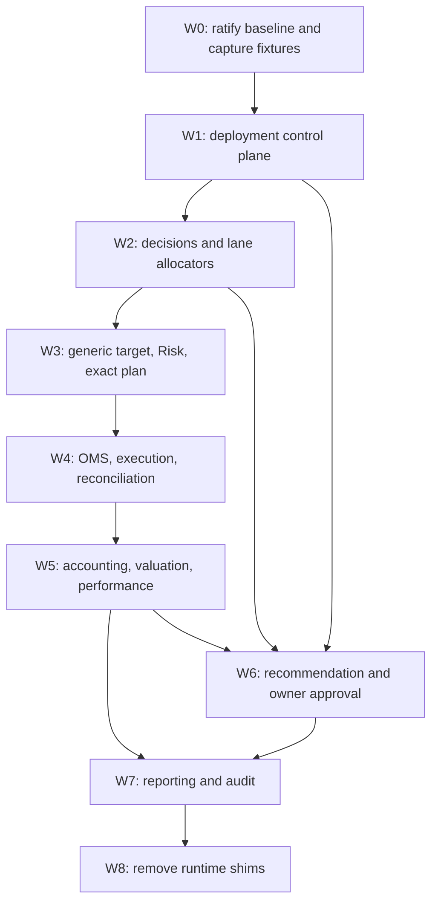

# Generic Deployment and Accounting Migration Plan

## 1. Purpose

This document is the implementation plan for completing the operating model
defined by [`CAERUS_OPERATING_SYSTEM_REFERENCE.md`](../CAERUS_OPERATING_SYSTEM_REFERENCE.md).
It does not define a competing architecture. The numbered stages in that
reference remain the controlling end-to-end model.

The migration objective is:

> Any owner-approved sleeve can be made eligible for a named Shadow, Paper, or
> Live lane through one versioned deployment policy. Each lane allocates only
> among its approved sleeves. Daily allocation may vary within owner-approved
> bounds, but sleeve lifecycle, lane eligibility, allocator objectives, risk
> limits, and capital ceilings change only through an explicit owner decision.
> Every executable order and every factual unit of P&L remains attributable to
> the lane, sleeve, and deployment version that caused it.

This document does not itself approve a strategy promotion, change the current
deployed allocation, enable live trading, alter broker credentials, or modify
cron. Implemented items recorded below are isolated advisory contracts unless
an explicit later status says otherwise.

### Controlling owner directive — 2026-08-18

The hash-bound decision record
[`owner_directive_2026-08-18_generic_lane_migration.json`](../governance/decision_records/owner_directive_2026-08-18_generic_lane_migration.json)
supersedes every unresolved-baseline or future-scope statement in earlier
sections of this plan:

- active generic PAPER is `NOT_YET_CUT_OVER`; the legacy runtime must remain
  unchanged while migration evidence is collected, and local Lyra edits remain
  candidate-only;
- Orion has no permanent sleeve status and is authorized only as a frozen
  legacy PAPER comparison fixture for generic dual-compute parity;
- adaptive sleeve allocation is required migration scope and must first run in
  Shadow; PAPER activation requires evidence returned to and approved by the
  owner;
- Paper and Live must use the same generic lane-neutral contracts, with only
  environment-specific broker adapters and stricter Live constraints; and
- disengaging the Live kill switch is conditionally authorized only at a
  verified generic Live cutover after all named preflights and an effective
  session approval. The legacy Live executor remains unauthorized.

The directive itself has `execution_authority=false` and
`activation_authority=false`. It does not authorize an order, broker mutation,
active PAPER change, schedule change, or premature kill-switch edit.
The corrected directive content hash is
`deaadea238da9505e5c0a85cb18e1db32303fa12308eb7807a7d3a7f637f0e59`.
Its correction record explicitly invalidates the earlier erroneous hash
`5b6ec1feda6e46c9dbf885c530b5a9db67f64cb7152251dc79329ccf36fd5381`,
which incorrectly inferred authority from local Lyra edits.

### Implementation progress — 2026-08-18

The first migration contracts now exist as isolated, non-runtime modules. They
are not wired into active configuration, cron, broker submission, or deployed
authority:

| Area | Implemented advisory contract | State |
|---|---|---|
| Deployment and owner approval | `caerus.lane_deployment_policy.v1`, `caerus.owner_decision.v1` | Contract and hash validation complete; no active policy created |
| Standard sleeve output | `caerus.sleeve_decision.v2`, `caerus.sleeve_decision_batch.v2` | Lane-neutral validation and allocator consumption complete; legacy v1 remains supported |
| Decision-production adapter | deterministic legacy evaluation-to-v2 batch adapter plus disabled scheduled-v2 factual pipeline | Exact expected-sleeve coverage, session/evaluation evidence, strategy inputs, and non-authority are proved; the scheduled path is observation-ready but no active schedule or authoritative producer is switched |
| Research allocation inputs | `caerus.research_allocation_policy.v1` | Eligible sleeve universe and static/regime weights are registry/deployment-hash-bound and advisory; active research evaluator globals remain unchanged |
| Lane allocation and target | `caerus.lane_allocation.v1`, `caerus.lane_target_package.v1` | Generic Orion/Lyra/multi-sleeve allocation and causal target lineage complete |
| Independent Risk | `caerus.lane_risk_package.v1` | APPROVE/CONSTRAIN/REJECT semantics complete; every output remains non-executable |
| Fan-out | `caerus.lane_control_plane_batch.v1`, `caerus.lane_risk_control_batch.v1` | Enabled lanes compile from one decision batch; exact Risk-review coverage required |
| Legacy parity adapter | in-memory legacy PAPER lane view | Reads either Orion- or Lyra-shaped legacy policy without selecting one; never persists or activates it |
| Exact planning | `caerus.execution_plan.v4` | Risk-approved target plus explicit broker snapshot and governed policy compile to an advisory, non-executable exact plan |
| Exact-plan dry-run wrapper | `caerus.lane_exact_plan_dry_run_result.v1` and explicit-input CLI | No-write default plus immutable content-addressed advisory persistence complete; no production wrapper or executor is wired |
| Target attainment | `caerus.lane_target_attainment_policy.v1`, `caerus.lane_target_attainment.v3` | Exact-plan and reconciliation-bound Paper/Live attainment, including whole/fractional shares and explicit drift blockers, is complete in advisory form |
| OMS and advisory WAL | `caerus.submission_wal_intent.v2`, advisory attempt/result contracts, locked immutable JSONL store | Exact-plan order lineage, lifecycle ordering, idempotency, recovery, and persistence complete; broker submission is structurally forbidden |
| Execution safety dry run | `caerus.lane_execution_safety_evidence.v1`, `caerus.lane_execution_dry_run.v1` | Paper/Live-shaped account pin, kill switch, deployment SHA, cap, leverage, shorting, open-order, credential, and freshness gates are enforced before a broker-incapable OMS lifecycle |
| Broker evidence boundary | `caerus.broker_observation_bundle.v1`, `caerus.lane_broker_evidence_collection.v1`, and `core.generic_live_v1_broker_collector` | Explicit read-only observations normalize into exact-plan-bound order/fill/ending-state evidence. The disabled generic Live wrapper now has a redacted Alpaca read-only collector; it has no submission capability and is not installed or scheduled in active runtime. |
| Read-only broker adapter | `caerus.lane_broker_read_collection.v1` | A dependency-injected adapter performs exactly account/position/order/fill reads, requires a redacted account pin, suppresses SDK exception contents, and cannot call a write method; a production Alpaca binding and scheduler remain unwired |
| Reconciliation | `caerus.lane_reconciliation.v1` and sealed broker order/fill/ending-state evidence | PASS/PARTIAL/REJECTED/UNRESOLVED, halt/escalation, economic proofs, and exact-plan-bound sleeve fill splits complete. The date-bound disabled generic Live wrapper connects fresh broker reads to causal closure and publishes a pointer only after closure; active scheduling remains uninstalled and activation remains blocked. |
| Accounting journal | `caerus.accounting_journal_entry.v1` | Balanced factual/theoretical event contract and immutable append semantics complete; no production journal builder wired |
| Reconciled-fill accounting | pure reconciliation-to-journal bridge | Accounting-ready PASS/PARTIAL fills compile deterministically to balanced sleeve entries with full causal lineage; scheduled collection and append remain unwired |
| Valuation and performance | `caerus.lane_valuation.v1`, `caerus.lane_performance.v1` | Reconciled factual and structurally separate theoretical surfaces complete in memory; deployment-segmented returns begin only at causal start |
| Lifecycle loop | recommendation, owner-decision, activation-candidate, and state-transition proposal v1 contracts | Exact recommendation/approval lineage and dry-run policy compilation complete; activation authority remains false |
| Truth status and reporting | `caerus.truth_lineage_status.v1`, `caerus.daily_lane_audit.v1`, `caerus.all_lane_audit.v1`, `caerus.dashboard_performance_surfaces.v1` | Factual claims fail closed unless journal, reconciliation, valuation, and performance lineage are green; Shadow remains explicitly modeled; owner actions are represented but never exercised |
| Advisory reporting persistence | content-addressed reporting store, reporting-session manifest, off-by-default dry-run builder | Time/version/lane coverage, atomic no-overwrite persistence, and no-write default complete; no scheduler or existing dashboard integration |
| End-to-end lineage | `caerus.session_lineage_manifest.v1` | Strict Stage 2–13 descriptor topology, enabled-lane coverage, readiness propagation, and accounting counts complete; no production session emitter is wired |
| Advisory accounting persistence | `caerus.lane_accounting_dry_run_result.v1` and explicit-write CLI | Exact plan plus reconciliation compile and optionally append idempotent journal entries; default is no write; no canonical path or scheduler is configured |
| Non-fill accounting | `caerus.non_fill_activity.v1` and pure journal emitter | Fees, dividends, interest, and external flows require exact sleeve allocation evidence and compile to balanced factual entries; corporate-action lot instructions remain separate |
| Cost basis | `caerus.lane_cost_basis.v1` | Deployment-scoped FIFO lots, realized P&L, marked unrealized P&L, and non-fill summaries are deterministic; ambiguous corporate actions and legacy-unattributed fills fail closed |
| Factual reporting inputs | `caerus.lane_factual_reporting_inputs.v1` | Exact-plan/reconciliation/journal-bound valuation, performance, and truth-status inputs build in memory; immutable persistence is explicit-opt-in and no scheduler is configured |
| Owner workflow persistence | `caerus.owner_workflow_package.v1` | Recommendation and bound decision persist content-addressed with an unsent owner outbox; no external delivery, approval inference, or activation occurs |
| Dashboard truth consumer | `caerus.dashboard_truth_payload.v1` | A UI-neutral disabled consumer accepts only validated truth-status projections, preserves suppression and permitted labels, and forbids fallback data; VM observation passes and the existing dashboard is not switched over |

The contract-focused migration suite currently passes. The broader legacy
suite still contains a quarantined baseline conflict: local uncommitted files
partially designate Lyra as PAPER while several tests and fixtures still encode
the committed Orion-PAPER authority. That conflict predates these modules and
is intentionally not resolved by this plan implementation without an owner
decision.

Factual Orion target-and-order parity is now complete in immutable advisory
evidence. Concrete production broker/environment bindings, active scheduler
and dashboard switches, explicit corporate-action lot instructions, runtime
cutover, and rollout work remain open; this progress note does not change the
definition of done in section 16.

Focused verification currently comprises 347 passing contract/integration
tests plus 121 passing adjacent broker-truth, ownership-ledger, rerun-safety,
portfolio-history, research-allocation, and broker-authority tests. A separate
legacy authority slice at the latest audit point had 23 passing and 123 failing
tests; those failures
encode the committed Orion-PAPER assumption while local candidate edits encode
Lyra-PAPER. They remain quarantined compatibility evidence and are not
normalized into authority by the new contracts.

#### Non-authoritative completion audit

This audit describes contract readiness, not deployed runtime readiness:

| Stage | Contract readiness | Remaining production gate |
|---:|---|---|
| 1. Governed Data In | Partial | Publish the governed deployment policy through the production configuration path and bind all production inputs to it |
| 2. Immutable Session Snapshot | Lineage-manifest contract ready | Emit the validated Stage 2–13 manifest from the production session with deployment policy hashes and actual artifact descriptors |
| 3. Sleeve Registry Fan-Out | Contract ready | Wire the generic control-plane batch into scheduled runtime and prove exact enabled-lane coverage |
| 4. Standard Sleeve Decisions | Contract ready | Migrate production producers to v2 while retaining measured v1 compatibility |
| 5. Portfolio Allocator | Contract ready | Run production-shadow parity and replace the PAPER-specific allocator only at an approved session boundary |
| 6. Canonical Portfolio Target | Contract ready | Persist one sealed target per enabled lane and prove uniqueness in the production manifest |
| 7. Independent Risk Gate | Contract ready | Connect independent production Risk evaluation without allowing the allocator to substitute strategy |
| 8. Execution Plan | Advisory contract ready | Complete parity evidence and authority wiring; v4 currently cannot execute |
| 9. OMS and Broker Execution | Advisory OMS/WAL/store ready | Build the production environment adapter and execution feedback path; broker submission remains structurally unavailable in the generic path |
| 10. Reconciliation | Disabled source path ready | Validate the connected read-only broker collector and causal closure in isolated rehearsal; install nothing until the factual Lyra chain and every activation gate are green |
| 11. Authoritative Accounting Ledger | Journal, fill bridge, and off-by-default persistence ready | Select the canonical journal path and wire scheduled broker-activity builders; add migration/opening, non-fill economics, and cost-basis production flows |
| 12. Valuation and Performance | Foundation ready | Build scheduled production valuation/performance from reconciled journal state and prove broker/account totals |
| 13. Reporting and Audit | Dry-run contract and store ready | Produce daily input bundles, then wire the scheduler and dashboard/scheduled outputs exclusively to validated truth-safe projections |
| Off-cycle approval loop | Dry-run contract ready | Persist recommendations and owner decisions, complete preflight evidence, and activate only through an owner-authorized session-boundary procedure |

No row above is an authorization to select a sleeve, activate a deployment,
submit an order, or allocate capital.

The owner-decision v1 field is an object while the lifecycle recommendation
patch is an RFC 6902 array. The dry-run compiler therefore accepts only the
literal, exact envelope `{"rfc6902_patch": [...]}` and requires it to echo the
recommendation byte-for-byte under canonical JSON. Older free-form approval
mappings remain readable decision records but cannot compile a deployment.
The compiled destination lane must also embody every approved risk limit and
must not exceed the approved capital ceiling.

## 2. Historical baseline and resolved migration authority

The committed as-built baseline is the owner-approved 2026-08-14 PAPER model:
one immutable session, complete registry fan-out, one configured PAPER
allocation, one sealed target, exact execution, reconciliation, causal PAPER
ownership, broker valuation, and daily audit. In that committed baseline Orion
has the PAPER risk budget and live capital is blocked.

The local working tree contains candidate edits designating Lyra for PAPER and
returning Orion to Shadow. Those edits are not authority. The controlling
corrected 2026-08-18 owner directive records generic PAPER as
`NOT_YET_CUT_OVER` and requires the legacy runtime authority to remain unchanged
through evidence collection. It does not retroactively rewrite the committed
Orion history: Orion is frozen as the legacy PAPER comparison fixture needed to
prove that the generic path reproduces the old economics, but it has no
permanent lane status. Any future Paper, Live, or Shadow membership still
requires a versioned deployment policy and the approval rules in this plan.

## 3. Executive assessment

Caerus has a substantial straight-through PAPER implementation, not merely a
design. The strongest reusable assets are:

- immutable session, sleeve-decision, allocation, and target artifacts;
- complete evaluation coverage for registered non-frozen sleeves;
- portfolio-level netting with per-symbol sleeve contributions;
- independent Risk authority and hash-bound exact PAPER plans;
- idempotency, broker reconciliation, causal fill ownership, and same-as-of
  valuation for the PAPER account; and
- research-only promotion and demotion recommendations.

The system is not yet generic end to end because:

- the control-plane schema describes one PAPER authority rather than a set of
  versioned lane deployments;
- lifecycle state, execution eligibility, and active deployment are conflated;
- decisions, allocation, target sealing, exact plans, WAL, audits, and
  performance paths contain PAPER-specific contracts;
- the isolated live-pilot path defaults to Orion, accepts a different target
  path, and is structurally disabled by code;
- factual ownership has sleeve quantities and market value, but not
  lane/deployment identifiers, sleeve cash, fees, realized P&L, or a complete
  sleeve NAV chain; and
- recommendations do not flow into an immutable owner approval/rejection and
  versioned deployment activation state machine.

The correct implementation strategy is therefore to generalize the existing
paper line while preserving all of its failure gates. The legacy live-pilot
path should converge on the same contracts rather than remain a second target
and accounting architecture.

## 4. Controlling design decisions

These decisions must be accepted before code implementation begins. Changing
one requires an amendment to this plan and the operating-system reference.

### 4.1 One session, one decision per sleeve, one target per lane

Stages 1–4 run once per market session. A standard sleeve decision is
lane-independent investment intent. Stages 5–13 are lane-scoped because Shadow,
Paper, and Live can have different approved sleeve sets, capital, broker state,
and accounting surfaces.

For each enabled lane and session there is exactly one authoritative allocation
and one canonical target. There may be several lane targets in the same global
session, but never two competing targets for the same lane.

### 4.2 Separate sleeve catalog, lifecycle approval, and deployment

The strategy registry defines what a sleeve is and its capabilities. A governed
lane-deployment policy defines where an approved sleeve may operate, its weight
bounds, capital ceiling, allocator, risk policy, effective session, and rollback
version. The scalar strategy `status` must no longer double as the complete
deployment model.

A sleeve can be explicitly present in more than one lane—for example, Live for
factual execution and Shadow for modeled comparison—without relabeling either
performance series.

### 4.3 Human-governed eligibility, model-directed routine allocation

Brett approves or rejects:

- promotion, deprecation, retirement, and reactivation;
- membership in Paper or Live;
- an increase in real capital or risk;
- allocator objective/method changes; and
- per-sleeve minimum/maximum weights and lane-level constraints.

Within those approved constraints, a daily allocator may assign any permitted
weight, including zero, without a new owner approval. It may not expand the
eligible sleeve set, change the total capital ceiling, loosen risk, or interpret
a research leaderboard as authorization.

### 4.4 Actual and theoretical performance never merge

Shadow performance remains modeled target-weight NAV. Paper and Live
performance comes only from reconciled broker fills, cash, fees, corporate
actions, positions, and marks. A new Paper or Live deployment starts factual
performance at its first reconciled economic event. Historical Shadow NAV is
never backfilled into factual performance.

### 4.5 Historical artifacts remain readable

New schemas are forward migrations. Readers must continue to validate existing
PAPER schema-3 bundles, `caerus.execution_plan.v3`, causal ledger artifacts, and
FR-104 evidence. No migration may rewrite historical fills or assign a sleeve
to a pre-cutover fill that lacks causal evidence.

## 5. Current-to-target audit matrix

| Stage | Current implementation evidence | Assessment | Target gap |
|---:|---|---|---|
| 1. Governed Data In | Registry, manifest, market/research inputs, broker state, and configuration are admitted into current workflows. | `PARTIAL` | Deployment policy and owner-decision artifacts are not first-class governed inputs; lane/account bindings are split across JSON and environment variables. |
| 2. Immutable Session Snapshot | `core/portfolio_operating_model.py` builds a hashed session manifest and `core/paper_target_authority.py` seals it into schema-3 PAPER bundles. | `IMPLEMENTED_FOR_PAPER` | Session lineage lacks `deployment_version`; the deployment policy hash and decision record are not sealed; lane artifacts are not represented as children of one global session. |
| 3. Sleeve Registry Fan-Out | `core/sleeve_control_plane.py` emits one terminal envelope per registered non-frozen sleeve. | `STRONG_BUT_PAPER_CENTRIC` | Active lifecycle excludes Live; each definition has global `capital_eligible`/`execution_eligible`; live eligibility is always false; the registry requires one PAPER authority. |
| 4. Standard Sleeve Decisions | `build_sleeve_decision_batch()` emits immutable per-sleeve outcomes and targets. | `PARTIAL` | `mode` is inferred as PAPER/SHADOW/RESEARCH, not lane-independent; the contract lacks required confidence, risk forecast, capacity, and deployment-independent eligibility fields. |
| 5. Portfolio Allocator | `allocate_portfolio()` supports multiple PAPER sleeves, configured risk budgets, overlap netting, and causal contributions. | `IMPLEMENTED_FIXED_POLICY_FOR_PAPER` | Policy schema is named PAPER, requires static weights, and has no lane-specific eligible universe, bounds, objective, cost/turnover constraint, or approved adaptive allocator. Research dynamic allocation is separate, hard-coded, and non-authoritative. |
| 6. Canonical Portfolio Target | `paper_target_package.json` binds decisions, allocation, sources, and target hash. | `IMPLEMENTED_FOR_PAPER` | Target compiler and filenames are PAPER-specific; no generic lane-target schema, deployment identity, or one-target-per-lane uniqueness gate exists. |
| 7. Independent Risk Gate | PAPER authorization enforces source hashes and Risk may constrain the target. FR-104 has additional live guardrails. | `PARTIAL` | Risk and target-attainment policies are account-scope/PAPER-specific; live controls sit in a separate path; a generic lane risk package does not bind deployment version and policy hash. |
| 8. Execution Plan | Exact PAPER plan v3 carries broker-ready orders and sleeve contributions. | `STRONG_FOR_PAPER` | `authority/exact_plan.py` rejects non-PAPER scopes, defaults to Orion, emits `caerus_paper_portfolio`, and validates against the current PAPER allocator. Live planning uses a separate artifact contract and contains Orion aliases. |
| 9. OMS and Broker Execution | PAPER has exact-plan authorization, WAL, stable client IDs, retry protection, and broker submission. FR-104 has an isolated live executor. | `PARTIAL` | WAL is PAPER-only; the shared executor still contains lane branches; live evidence does not use the same exact-plan/WAL lineage; live cron defaults to Orion and is hard-disabled. |
| 10. Reconciliation | PAPER intended/submitted/terminal/positions reconciliation is strict. FR-104 reports CLEAN/PARTIAL/REJECTED/UNRESOLVED. | `PARTIAL` | There is no common lane reconciliation contract keyed by deployment version; daily audit and pointers are fixed to PAPER paths; live and paper reconciliation cannot be audited uniformly. |
| 11. Authoritative Accounting Ledger | Broker-truth account ledgers exist for PAPER and Live; PAPER causal fills map exact orders to sleeve quantities and market value. | `PARTIAL` | Causal rows lack `lane_id` and `deployment_version`; cash is owned by `portfolio_cash`, not sleeve subledgers; fees, dividends, external flows, lots, and realized P&L are not completely journaled by sleeve. Live trade ledger omits decision/allocation/deployment lineage and swallows write failures. |
| 12. Valuation and Performance | PAPER account NAV is broker-authoritative; causal valuation reconciles equity, cash, and positions; Shadow NAV is separately computed. | `PARTIAL` | There is no authoritative sleeve cash/NAV/return series by lane and deployment; factual paper return is account-level; dashboard sleeve rows still source modeled Shadow NAV and leave factual paper return null. |
| 13. Reporting and Audit | PAPER daily audit proves session-to-report lineage and a single as-of. Dashboard and research reports expose many diagnostics. | `PARTIAL` | Audit is hard-coded to PAPER paths; no lane/deployment coverage matrix exists; dashboard cannot consistently display modeled Shadow versus factual Paper/Live at sleeve level; current deployment and pending approvals are not prominent. |
| Off-cycle lifecycle loop | Promotion governance emits deterministic PROMOTE/WATCH/HOLD/DEMOTE/BLOCKED research artifacts. | `RECOMMENDATION_ONLY` | No canonical RETAIN/DEPRECATE vocabulary, immutable approval/rejection artifact, exact policy-diff proposal, expiry, effective session, activation compiler, or rollback linkage exists. |

## 6. Target machine contracts

The implementation should introduce the following contracts. Names and
required fields are fixed for planning; a schema revision must preserve their
semantics.

### 6.1 Sleeve catalog

`config/research/strategy_registry.json` remains the sleeve catalog. Its next
schema must hold stable identity, capabilities, research lifecycle metadata,
source adapter, and evidence eligibility. Active lane membership and account
capital must move out of per-strategy `paper_execution` blocks.

Required capability fields include:

```text
sleeve_id, strategy_type, family, source_adapter, produces_targets,
supported_asset_classes, supported_lanes, evidence_status, frozen,
promotion_eligible, benchmark
```

### 6.2 Lane deployment policy

Create `config/deployment/lane_deployment_policy.json` with schema
`caerus.lane_deployment_policy.v1`.

Required top-level fields:

```text
deployment_version, status, approved_by, owner_decision_id,
approved_at, effective_session, prior_deployment_version,
rollback_deployment_version, content_hash, lanes
```

Each lane requires:

```text
lane_id, lane_kind, enabled, account_id_hash, broker_environment,
performance_surface, eligible_sleeves[], allocator_policy,
risk_policy, capital_policy, execution_policy, reconciliation_policy
```

Each eligible sleeve row requires:

```text
sleeve_id, minimum_weight, maximum_weight, initial_weight,
allocation_eligible, execution_eligible, observation_enabled
```

`capital_policy` must distinguish a risk ceiling from current account equity.
For a capped Live pilot, effective deployable capital is the least of current
reconciled broker equity, owner-approved ceiling, and any tighter risk limit.
The proposed Lyra pilot would therefore use a `$500` owner-approved ceiling and
the actual reconciled account equity, not assume that the account still holds
exactly `$500`.

### 6.3 Lifecycle recommendation

Schema `caerus.lifecycle_recommendation.v1` is advisory and non-executable.
Required fields:

```text
recommendation_id, generated_at, expires_at, action,
sleeve_id, current_stage, proposed_stage, source_lane, destination_lane,
proposed_capital_change, evidence_refs[], evidence_hashes[], gate_results,
confidence, reason_codes, proposed_policy_patch, requires_owner_approval=true,
execution_authority=false, content_hash
```

Allowed actions are `PROMOTE`, `RETAIN`, `DEPRECATE`, and `HOLD`.
`DEPRECATE` means remove from new allocation eligibility while preserving
history. `RETIRED` remains a later owner-approved terminal lifecycle state.

### 6.4 Owner decision

Schema `caerus.owner_decision.v1` is the only artifact that can authorize a
lifecycle or capital-policy mutation. Store immutable records beneath
`config/governance/owner_decisions/` and reference the document decision record.

Required fields:

```text
owner_decision_id, recommendation_id, recommendation_hash,
decision=APPROVE|REJECT, owner, decided_at, effective_session,
approved_policy_patch, capital_ceiling, risk_limits,
preflight_requirements, rollback_deployment_version, expires_at, content_hash
```

An approval compiler may create a new pending deployment version from this
record. It may not mutate the active version in place. A rejection changes no
policy.

### 6.5 Standard sleeve decision v2

Schema `caerus.sleeve_decision.v2` remains a single session/sleeve decision and
adds:

```text
confidence, forecast_risk, capacity, expected_turnover,
liquidity_status, source_method, decision_grade, target_rows,
reason_codes, source_artifacts, session_id, decision_id, content_hash
```

It must not contain an active execution lane. Lane eligibility is joined from
the sealed deployment policy at allocation time.

### 6.6 Lane allocation and target

Schemas `caerus.lane_allocation.v1` and `caerus.lane_target_package.v1` require:

```text
session_id, lane_id, deployment_version, allocation_id,
allocator_policy_hash, eligible_sleeves, sleeve_weights,
decision_ids, decision_hashes, target_rows, target_hash,
capital_basis, target_cash, constraints, source_hashes, content_hash
```

Each target symbol retains every contributing sleeve's target weight,
allocation fraction, decision ID, and decision hash. The allocator must prove
that it used only the lane's approved sleeves and respected each weight bound.

### 6.7 Exact execution and OMS

Add `caerus.execution_plan.v4` and `caerus.submission_wal_intent.v2` rather than
changing historical v3/v1 semantics. Both require:

```text
lane_id, lane_kind, deployment_version, account_id_hash,
session_id, allocation_id, target_hash, plan_id,
sleeve_contributions, policy_hashes
```

The exact-plan builder accepts a lane policy and broker adapter; it must not
read the active registry implicitly while rebuilding historical plans. PAPER
and LIVE use the same plan and WAL contracts. Lane-specific broker guards may
tighten submission but may not select or reconstruct a target.

### 6.8 Accounting journal and performance

Add append-only schemas:

- `caerus.accounting_journal_entry.v1`;
- `caerus.lane_ownership.v1`;
- `caerus.lane_valuation.v1`; and
- `caerus.lane_performance.v1`.

Every economic journal entry requires:

```text
journal_entry_id, event_type, event_time, trade_date,
account_id_hash, lane_id, deployment_version, sleeve_id,
symbol, quantity, price, gross_amount, fee_amount, net_amount,
session_id, decision_id, allocation_id, plan_id,
broker_order_id, fill_id, source_hash, record_hash
```

Supported event types include opening capital, allocation transfer, buy, sell,
fee, dividend, interest, corporate action, external flow, and mark. Journal
entries balance at the lane/account level. Sleeve NAV includes sleeve-owned
cash and positions; account NAV reconciles to the sum of sleeve NAV plus only
explicit unattributed legacy capital.

## 7. Workstreams

### Workstream 0 — Ratify authority and capture the migration baseline

Purpose: remove source ambiguity before runtime changes.

Actions:

1. Brett ratifies or amends `CAERUS_OPERATING_SYSTEM_REFERENCE.md`.
2. Record a decision on the uncommitted Lyra-PAPER change: reject it, or retain
   it as an explicitly dated but not-yet-deployed decision.
3. Capture immutable fixtures from the last clean schema-3 PAPER session and
   the last complete FR-104 dry-run/live evidence bundle.
4. Record the deployed git SHA, deployment attestation, account ID hashes,
   causal epoch, broker NAV as-of, and active cron state.
5. Freeze economic behavior until Workstream 3 parity is proven.

Affected documents/artifacts:

- `docs/CAERUS_OPERATING_SYSTEM_REFERENCE.md`
- `docs/governance/ORCHESTRATOR_CONTEXT.md`
- `docs/governance/CURRENT_RESEARCH_ROADMAP.md`
- `docs/governance/decision_records/` (create if absent)
- fixture copies under `Tests/fixtures/generic_lane_migration/`

Acceptance:

- one documented owner decision identifies the migration baseline;
- committed, working-tree, and deployed state are explicitly distinguished;
- historical fixtures validate without mutation.

### Workstream 1 — Introduce the deployment control plane

Purpose: make lane membership a versioned policy instead of scattered code and
environment assumptions.

Actions:

1. Add the lane-deployment policy and owner-decision schemas and validators.
2. Refactor `core/strategy_registry.py` and `core/sleeve_control_plane.py` so
   sleeve identity/capability is separate from deployment membership.
3. Remove the exactly-one-PAPER-strategy invariant and replace it with:
   exactly one active deployment version; unique lane IDs; complete policy
   hashes; valid account bindings; and per-lane eligible-set consistency.
4. Seal deployment policy and owner-decision hashes into the session manifest.
5. Preserve a compatibility reader that converts current
   `paper_allocation_policy` into an in-memory legacy PAPER lane during the
   parity period. New writes use only v1 lane policy.

Create/refactor:

- `config/deployment/lane_deployment_policy.json` (new, initially disabled or
  behavior-equivalent to the committed PAPER policy)
- `config/governance/owner_decisions/` (new)
- `core/deployment_policy.py` (new)
- `core/owner_decision.py` (new)
- `core/strategy_registry.py`
- `core/sleeve_control_plane.py`
- `core/precompute_bundle_validation.py`
- `research_registry/sleeves/manifest.py`

Tests:

- `Tests/test_deployment_policy.py` (new)
- `Tests/test_owner_decision_contract.py` (new)
- extend `Tests/test_strategy_registry.py`,
  `Tests/test_sleeve_control_plane.py`, and
  `Tests/test_precompute_bundle_validation.py`.

### Workstream 2 — Standardize decisions and implement lane allocators

Purpose: evaluate sleeves once, then allocate only within each approved lane.

Actions:

1. Add standard sleeve-decision v2 fields and adapters for existing Shadow and
   research artifacts.
2. Build `allocate_lane()` over the current netting/contribution logic.
3. Emit one allocation per enabled lane, all bound to the same session and
   decision batch.
4. Initially support `configured_risk_budget_v1` for exact PAPER parity.
5. Add a plug-in allocator interface with deterministic inputs/outputs and
   constraints. Promote an adaptive allocator only after it runs as a
   non-authoritative Shadow recommendation and passes preregistered tests.
6. Replace the hard-coded research allocator universe and policy tables with a
   registry/deployment-driven research implementation. Keep it
   `execution_authority=false` until separately approved.

The adaptive allocator's approved objective must be explicit. At minimum it
must consider expected opportunity, evidence quality, risk, overlap,
concentration, turnover, liquidity/capacity, and estimated cost. It must expose
why a sleeve received zero weight. Recent return alone is not an acceptable
objective.

Create/refactor:

- `core/sleeve_decision.py` (new contract/adapters)
- `core/lane_allocator.py` (new)
- `core/portfolio_operating_model.py`
- `core/paper_target_authority.py` (compatibility wrapper only after migration)
- `research/dynamic_strategy_allocation.py`
- `research/promotion_readiness_windows.py`
- `research/promotion_governance.py`

Tests:

- `Tests/test_standard_sleeve_decision.py` (new)
- `Tests/test_lane_allocator.py` (new)
- extend `Tests/test_sleeve_control_plane.py` with multi-lane fixtures
- keep `Tests/test_dynamic_strategy_allocation.py` research-only assertions.

### Workstream 3 — Build one generic target, Risk, and exact-plan path

Purpose: remove strategy- and lane-specific target compilation without
weakening independent Risk.

Actions:

1. Add `core/lane_target_authority.py` to compile and seal one target package
   per enabled lane from the lane allocation.
2. Move policy-derived identity out of constants in
   `core/strategy_identity.py`; resolve identity only from sealed policy and
   target artifacts. Aliases are input conveniences, never authority.
3. Generalize target-attainment policy to explicit lane/account scope while
   preserving whole-share PAPER semantics and allowing tighter Live policy.
4. Add exact-plan v4 with lane/deployment identity and a compatibility reader
   for v3.
5. Refactor `scripts/live_pilot_build_plan_from_precompute.py` into a generic
   lane plan builder. Remove the Orion allow-list and all fallback sleeve IDs.
6. Refactor `scripts/authorize_exact_execution_plan.py` to validate the sealed
   lane policy/target rather than the current global PAPER allocator.
7. Require Risk output to bind session, lane, deployment, allocation, target,
   account, and policy hashes. Risk may reduce exposure or raise cash only.

Create/refactor:

- `core/lane_target_authority.py` (new)
- `core/lane_target_attainment_policy.py` (new or generalized replacement)
- `core/strategy_identity.py`
- `core/paper_target_authority.py`
- `authority/exact_plan.py`
- `scripts/build_lane_execution_plan.py` (new)
- `scripts/live_pilot_build_plan_from_precompute.py` (legacy wrapper)
- `scripts/authorize_exact_execution_plan.py`
- `core/precompute_bundle_validation.py`

Tests:

- `Tests/test_lane_target_authority.py` (new)
- `Tests/test_exact_execution_plan_v4.py` (new)
- extend `Tests/test_strategy_identity.py`,
  `Tests/test_exact_execution_choice2.py`,
  `Tests/test_paper_target_authority.py`, and
  `Tests/test_precompute_contract.py`.

Required parity proof:

- given the same committed Orion PAPER inputs and broker state, the generic
  configured allocator and target compiler produce the same economic target,
  same whole-share proof, same intended orders, same cash constraints, and
  equivalent failure decisions as the current path; only schema/identity
  metadata may differ.

### Workstream 4 — Unify OMS, execution, and reconciliation by lane

Purpose: make Paper and capped Live consume the same execution authority while
retaining environment-specific safety gates.

Actions:

1. Add WAL v2 with lane/deployment identity; retain v1 reader for history.
2. Extract the shared executor from `scripts/live_pilot_execute.py` into a
   lane-neutral core. Keep thin PAPER and LIVE wrappers that bind credentials,
   endpoints, and stricter guardrails.
3. Replace mode inference from output paths with sealed plan identity.
4. Standardize workflow pointers and reconciliation artifacts under
   `outputs/workflow/<date>/lanes/<lane_id>/`.
5. Add `caerus.lane_reconciliation.v1` covering intended, WAL, submitted,
   terminal orders, fills, positions, and cash.
6. Preserve live kill switch, account pin, maximum approved ceiling, no
   leverage/shorting, deployment SHA guard, and ambiguity-no-retry behavior.
7. Remove the structural live disable only in a separate owner-approved
   activation change after all prior workstreams pass. Removing it is not part
   of a refactor-only commit.

Create/refactor:

- `core/submission_wal.py`
- `core/lane_execution.py` (new)
- `core/lane_reconciliation.py` (new)
- `scripts/execute_lane.py` (new)
- `scripts/live_pilot_execute.py`
- `scripts/run_precomputed_alpaca_execution.py`
- `scripts/cron_execute.sh`
- `scripts/cron_live_pilot_execute.sh`
- `scripts/cron_live_pilot_confirm.sh`
- `core/execution_integrity.py`
- `core/economic_reconciliation.py`

Tests:

- `Tests/test_submission_wal_v2.py` (new)
- `Tests/test_lane_reconciliation.py` (new)
- extend existing execution integrity, duplicate-submission, retry,
  equality-gate, lifecycle-timeline, live-pilot guardrail, and scenario-matrix
  suites.

### Workstream 5 — Complete lane/sleeve/deployment accounting

Purpose: make Paper and Live returns factual at the sleeve level.

Actions:

1. Preserve `scripts/build_broker_truth_ledger.py` as the broker account truth
   collector, but add account/lane/deployment bindings to its manifests.
2. Replace the PAPER-only causal build entrypoint with a lane-aware journal
   builder consuming broker activities, orders, exact plans, and deployment
   history.
3. Journal cash and non-fill economics: fees, dividends, interest, corporate
   actions, transfers, and external capital flows.
4. Track tax lots or an explicitly chosen deterministic cost-basis method by
   sleeve so realized and unrealized P&L reconcile.
5. Allocate fills using exact order contributions. A fill may never be assigned
   to a sleeve absent exact lineage. Preserve `legacy_unattributed` before the
   causal epoch.
6. Add sleeve cash accounts and balanced capital-allocation transfer entries.
7. Build lane and sleeve valuations from one broker as-of and prove:

```text
broker account equity
  = lane cash + lane positions
  = sum(sleeve cash + sleeve positions) + explicit legacy_unattributed
```

8. Build factual daily returns net of fees and adjusted for external flows.
   Segment each factual series by deployment version and first reconciled
   economic event.

Create/refactor:

- `core/accounting_journal.py` (new)
- `core/lane_ownership_ledger.py` (new)
- `core/lane_valuation.py` (new)
- `core/lane_performance.py` (new)
- `core/causal_ownership_ledger.py` (legacy reader/bridge)
- `core/live_trade_ledger.py` (deprecate as authority after migration)
- `scripts/build_broker_truth_ledger.py`
- `scripts/build_lane_accounting.py` (new)
- `scripts/build_causal_paper_ledger.py` (legacy wrapper)
- `scripts/build_portfolio_history.py`

Tests:

- `Tests/test_accounting_journal.py` (new)
- `Tests/test_lane_ownership_ledger.py` (new)
- `Tests/test_lane_valuation.py` (new)
- `Tests/test_lane_performance.py` (new)
- extend `Tests/test_causal_ownership_ledger.py`,
  `Tests/test_broker_truth_ledger.py`,
  `Tests/test_portfolio_history_builder.py`, and rerun-safety tests.

### Workstream 6 — Add the recommendation and owner-approval loop

Purpose: let the system initiate governed lifecycle decisions without acting on
them.

Actions:

1. Normalize research outputs to PROMOTE/RETAIN/DEPRECATE/HOLD while preserving
   current detailed gate results.
2. Make recommendations registry-driven and lane-aware. A recommendation must
   state the exact current policy, proposed patch, capital/risk change,
   evidence hashes, blockers, expiry, and rollback version.
3. Add an owner-decision writer/validator. It must require an explicit Brett
   approval or rejection and cannot infer approval from conversation text,
   ranking, dashboard state, or the presence of a recommendation file.
4. Add a deployment compiler that applies an approved patch to the prior policy,
   validates invariants, writes a new `PENDING` version, runs preflight, and
   activates only at the approved session boundary.
5. Add idempotent rejection, expiry, duplicate-decision, and supersession
   handling.
6. Emit owner-facing notifications, but keep notifications non-authoritative.

Create/refactor:

- `core/lifecycle_recommendation.py` (new)
- `core/owner_decision.py` (new)
- `core/deployment_compiler.py` (new)
- `scripts/build_lifecycle_recommendations.py` (new)
- `scripts/record_owner_decision.py` (new)
- `scripts/compile_deployment_policy.py` (new)
- `research/promotion_governance.py`
- `research/promotion_readiness_windows.py`
- `research/review_packet.py`
- `research_registry/research/model_tournament.py`

Tests:

- `Tests/test_lifecycle_recommendation.py` (new)
- `Tests/test_owner_decision_contract.py` (new)
- `Tests/test_deployment_compiler.py` (new)
- extend `Tests/test_promotion_governance.py`,
  `Tests/test_promotion_readiness_windows.py`, and research review packet tests.

### Workstream 7 — Make reporting and audit surface the truth

Purpose: expose deployment state, approval state, and performance surface
without ambiguity.

Actions:

1. Generalize daily audit to run once per enabled lane and then emit an
   aggregate all-lane audit.
2. Dashboard every return with `performance_surface`, `lane_id`, `sleeve_id`,
   `deployment_version`, inception/as-of dates, reconciliation status, and
   source hash.
3. Display modeled Shadow, factual Paper, and factual Live as distinct series;
   never choose one based on the sleeve's lifecycle label.
4. Show active deployment version, prior/rollback version, capital ceiling,
   effective deployable capital, pending recommendation, and pending owner
   decision.
5. Block or suppress factual return claims when journal, valuation, or
   reconciliation is not green.
6. Add one owner-facing lifecycle inbox for recommended actions and their
   evidence, with Approve/Reject as explicit external actions that generate the
   owner-decision artifact.

Create/refactor:

- `core/daily_portfolio_audit.py`
- `scripts/build_daily_portfolio_audit.py`
- `scripts/research/build_dashboard_v1.py`
- `scripts/research/build_quant_dashboard.py`
- `web/dashboard/quant_daily_executive.js`
- `web/dashboard/index.html`
- health/status and notification builders that consume these artifacts.

Tests:

- `Tests/test_daily_lane_audit.py` (new)
- `Tests/test_dashboard_performance_surfaces.py` (new)
- extend dashboard decision-grade, execution-integrity, portfolio audit,
  workflow email, and health-check tests.

### Workstream 8 — Remove compatibility shims after observation

Purpose: finish the migration rather than leave two permanent authorities.

Only after generic PAPER and Live dry-run observation pass:

1. stop writing new PAPER-only target schemas;
2. retire runtime reads of identity constants and `paper_capital_authority`;
3. retire direct FR-104 target construction and the non-causal live trade
   ledger as authorities;
4. retain read-only historical parsers and archived runbooks;
5. update the canonical as-built contract to the generic implementation.

No historical artifact is deleted.

## 8. Dependency graph and implementation order



Workstreams may have parallel implementation branches only after their input
schemas are frozen. W4 must not activate live submission before W5 and W7 can
reconcile and report it.

## 9. Migration stages and promotion gates

### Migration A — Contract-only foundation

Ship schema validators, policy readers, decision records, and compatibility
readers. Generate no new executable target. Validate historical fixtures.

Exit gate: all old artifacts validate; new policy rejects missing approval,
unknown sleeve, account mismatch, invalid weight bounds, cap increase,
overlapping effective versions, and missing rollback.

### Migration B — Dual-compute PAPER parity

Run the generic session/decision/allocation/target path beside the current
PAPER path with `execution_authority=false`. Compare economic targets and
orders for multiple clean sessions.

Exit gate: exact economic parity or a reviewed, explained, owner-approved
difference; no target substitution; all failure cases fail closed.

### Migration C — Generic PAPER authority

At an approved session boundary, make the generic lane target the sole PAPER
authority while retaining the current executor wrappers. Start the new
deployment-version ledger segment. Keep Live structurally blocked.

Exit gate: clean scheduled PAPER sessions with full session-to-ledger audit,
same-as-of valuation, factual sleeve NAV, idempotent rerun, and tested rollback.

### Migration D — Live read-only and dry-run convergence

Bind the real account by hash, read current broker equity, compile a disabled
candidate Live lane, and generate generic exact plans in dry-run only. Compare
with FR-104 guardrails and confirm zero broker writes.

Exit gate: account/cap/position preflight, generic target identity, dry-run
exact plan, kill switch, reconciliation simulation, accounting simulation, and
dashboard are green.

### Migration E — Owner-approved capped Live activation

This is a separate capital decision, not an automatic migration step. A
candidate policy may propose Lyra as the only eligible Live sleeve, with the
approved ceiling and effective capital derived from reconciled equity. Orion
may be the Paper sleeve and Polaris the Shadow reference only if the owner
decision explicitly records that complete policy.

Activation requires:

- an unexpired APPROVE owner-decision artifact;
- exact sleeve, lane, account hash, ceiling, risk limits, effective session,
  and rollback version;
- live credentials and endpoint pins outside git;
- current deployment SHA attestation;
- clean read-only broker preflight and no open-order ambiguity;
- live kill switch confirmed operational;
- a successful dry-run from the same deployment version; and
- accounting/reporting readiness for the first fill.

Exit gate: first terminal broker outcome reconciles. A clean fill starts the
factual Lyra-Live series. A rejection, partial, unresolved order, identity
break, or accounting break halts the lane and escalates; it does not trigger an
automatic corrective order.

### Migration F — Adaptive lane allocation

After the generic fixed allocator is stable, run an adaptive allocator as
Shadow-only advice. Its objective, constraints, evidence window, turnover
penalty, and rollback are preregistered. Enabling it in Paper or Live requires
an owner decision because it changes economic allocation policy.

Exit gate: deterministic replay, no look-ahead, stable eligible-set enforcement,
bounded turnover/cost, adversarial tests, and owner approval for each lane.

## 10. Acceptance test matrix

The migration is not accepted by unit tests alone. It requires contract,
fixture, failure, parity, integration, and scheduled-observation evidence.

| Test class | Required proof |
|---|---|
| Schema | Unknown fields, invalid hashes, unsupported versions, missing approval, ambiguous active version, invalid lane/account/sleeve, and unbalanced weights fail closed. |
| Registry/deployment | A sleeve can be explicitly eligible in multiple lanes; a lane cannot allocate to an unapproved sleeve; scalar lifecycle metadata cannot grant execution. |
| Session/decision | One global session and one decision per expected sleeve; deployment and decision hashes remain stable and complete. |
| Allocation | Fixed-policy parity; multi-sleeve overlap netting; zero-weight sleeves; min/max bounds; unavailable sleeve policy; cost/turnover limits; no recent-winner bypass. |
| Target/Risk | Exactly one target per lane/session/deployment; Risk cannot add a symbol or exposure; policy/hash mismatch blocks. |
| Exact plan | PAPER and LIVE plans share v4 semantics; lane/account/deployment mismatch blocks; historical v3 remains readable. |
| OMS | Stable client IDs, WAL-before-submit, ambiguous retry block, duplicate/open-order block, terminal status handling, and kill switch. |
| Reconciliation | Intended = WAL = submitted; fills and positions reconcile; unresolved state prevents green. |
| Accounting | Fill split, partial fill, fee, dividend, external deposit/withdrawal, overlapping symbol, sell, corporate action, cash transfer, and legacy unattributed cases balance. |
| Valuation/performance | One as-of; account = sleeves + legacy; external-flow-adjusted returns; fees included; no Shadow backfill; deployment inception at first reconciled event. |
| Lifecycle | PROMOTE/RETAIN/DEPRECATE/HOLD recommendations are non-executable; approve/reject/expire/supersede are idempotent; only approved exact patches compile. |
| Reporting | Every displayed return has a surface and source; non-green factual series are suppressed; active/pending/rollback policy is visible. |
| End to end | Global session → lane decisions → allocation → target → Risk → plan → WAL → broker fixture → reconciliation → journal → valuation → performance → audit passes for Shadow, Paper, and disabled/dry Live fixtures. |
| Rollback | Prior deployment version restores without rewriting journal/history or reusing stale targets; live kill switch blocks broker calls. |

Required existing suites include the focused registry, sleeve-control,
precompute, exact-execution, execution-integrity, lifecycle-timeline,
reconciliation, broker-ledger, causal-ownership, portfolio-history, daily-audit,
dashboard, health, and live-pilot guardrail suites. VM validation remains the
final predeployment check.

## 11. Operational rollout controls

1. Every migration activation is a versioned deployment, never an in-place
   config edit on the VM.
2. Deployment uses the existing full-SHA attestation and source lock.
3. Only one deployment version can be ACTIVE for a lane at a time.
4. A session begun under one deployment version finishes under that version;
   mid-session policy switching is forbidden.
5. The prior version and artifacts remain available for rollback and audit.
6. PAPER cutover precedes any Live cutover.
7. Live starts disabled, then read-only, then dry-run, then explicitly approved
   capped submission.
8. No cron entry becomes authoritative until the corresponding manual workflow
   has passed and its runbook is current.
9. Universal GREEN requires every enabled lane to be green or explicitly
   disabled. A hidden failed lane is not green.

Stop conditions include any source conflict, missing policy hash, stale target,
account mismatch, cap ambiguity, open-order ambiguity, Risk substitution,
lineage break, WAL failure, non-terminal order, position/cash mismatch,
unbalanced journal, mixed as-of, or mislabeled performance.

## 12. Rollback

Rollback has three layers:

### Policy rollback

Activate the recorded `rollback_deployment_version` at the next safe session
boundary after validating that its account and credential bindings remain
valid. Do not edit the failed policy in place.

### Operational rollback

For Live, set the kill switch, disable scheduled submission, preserve broker
and run artifacts, and allow read-only reconciliation/accounting to continue.
Do not liquidate or place corrective orders automatically. PAPER may revert to
the last validated deployment after broker truth and expected positions are
reconciled.

### Code rollback

Use a scoped git revert and redeploy through full-SHA validation. Compatibility
readers keep prior artifacts readable. Journal and broker evidence are
append-only and are never reverted or deleted.

## 13. Documentation changes required with implementation

Each workstream must update the narrow authoritative documents it affects:

- ratify/amend `docs/CAERUS_OPERATING_SYSTEM_REFERENCE.md` to clarify one
  global session and one canonical target per lane;
- replace the dated PAPER-only implementation description in
  `docs/architecture/caerus_as_built_data_flow.md` only after deployment;
- update `docs/DOCUMENTATION_STATUS_REGISTER.md` when new contracts become
  canonical;
- update `docs/governance/CURRENT_RESEARCH_ROADMAP.md`,
  `docs/governance/ORCHESTRATOR_CONTEXT.md`, and `AGENTS.md` state summaries;
- record each owner decision and deployment version in immutable decision and
  change indexes;
- update PAPER, Live, accounting, reconciliation, incident, kill-switch,
  deployment, and rollback runbooks; and
- preserve FR-069, FR-104, incidents, and dated implementation reviews as
  historical records rather than rewriting their past claims.

The nightly documentation process may refresh verified current-state summaries.
It must not create or imply an owner approval, mutate a deployment policy, or
rewrite a historical decision.

## 14. Explicit non-goals

- No strategy alpha, ranking, universe, cadence, holding-count, or exit-rule
  change is part of this migration.
- No claim that Lyra's modeled Shadow return is factual Paper or Live return.
- No automatic lifecycle or capital decision.
- No live-capital enablement in a refactor or schema commit.
- No increase above the owner-approved Live ceiling, no leverage, no shorting,
  no options, and no margin-policy change.
- No adaptive allocator in an executable lane until its separate evidence and
  approval gates pass.
- No rewriting or forced attribution of historical broker activity.
- No deletion of legacy readers or artifacts before observation and archival
  acceptance.
- No replacement of independent Risk with allocator or strategy logic.

## 15. Principal risks and mitigations

| Risk | Mitigation |
|---|---|
| A generic abstraction weakens proven PAPER gates | Start with economic parity; port gates before authority; test failure equivalence; keep compatibility rollback. |
| Two target authorities coexist | Mark dual-compute outputs non-executable; enforce one target per lane; remove runtime shims after observation. |
| Lifecycle and deployment are conflated again | Separate catalog, recommendation, owner decision, and deployment schemas; prohibit scalar status from granting execution. |
| Adaptive allocator chases recent winners | Owner-approved objective/bounds, minimum evidence, turnover/cost penalties, deterministic replay, Shadow observation, and zero automatic promotion. |
| Shared-account cash makes sleeve returns incorrect | Balanced sleeve cash journal, explicit capital transfers, fee/flow treatment, and account-to-sleeve reconciliation. |
| Live and Paper use different causal identities | Same v4 exact plan, WAL v2, reconciliation, and journal contracts; environment adapter only at broker boundary. |
| A deployment change invalidates historical plan reads | Historical readers validate against sealed policy hashes, not the current active registry. |
| Dashboard labels lifecycle as performance | Performance surface is required data, not inferred UI text; suppress claims without authoritative source. |
| Uncommitted or deployed state is mistaken for owner intent | Workstream 0 decision record; active deployment requires decision ID, version, hash, effective session, and attestation. |

## 16. Definition of done

The migration is complete only when all of the following are true:

1. The operating-system reference is owner-ratified and names this plan or its
   successor as the approved migration record.
2. One validated, versioned deployment policy is the only machine authority for
   lane membership, capital ceilings, allocator policies, and rollback.
3. Every expected sleeve emits one standard decision per global session.
4. Every enabled lane allocates only among its explicitly approved sleeves and
   produces exactly one canonical target.
5. No Orion, Lyra, Polaris, PAPER, or Live fallback can select a target in code;
   identity comes from the sealed deployment and target artifacts.
6. Paper and Live use the same target, Risk, exact-plan, WAL, reconciliation,
   accounting, valuation, performance, and audit contract families, with
   stricter Live guards allowed only as constraints.
7. Every post-cutover fill traces through
   `session_id + lane_id + sleeve_id + deployment_version + decision_id +
   allocation_id + target_hash + plan_id + broker_order_id + fill_id`.
8. Sleeve cash, positions, fees, flows, realized P&L, unrealized P&L, NAV, and
   returns reconcile to broker account truth at one as-of.
9. Modeled Shadow, factual Paper, and factual Live returns are stored and shown
   as separate surfaces with no historical backfill.
10. The system emits PROMOTE/RETAIN/DEPRECATE/HOLD recommendations with exact
    evidence and policy diffs, but no lifecycle or capital change occurs
    without an immutable Brett approval.
11. A prior deployment can be restored without rewriting history, and the Live
    kill switch blocks submission under test and observed operation.
12. Generic PAPER scheduled observation, generic Live dry-run, full focused
    tests, documentation checks, and VM validation pass.
13. Legacy runtime authorities are removed or disabled; historical readers and
    evidence remain available.

Until all thirteen conditions hold, the system may be described as having a
generic sleeve framework or a generic PAPER allocator, but not as having
generic deployment-and-accounting end to end.

## 17. Requirement-by-requirement residual audit — 2026-08-18

This section records the pre-directive audit. Section 19 is the controlling
post-directive status where the two differ.

This audit is the controlling answer to “what remains?” It distinguishes code
that can still be completed without selecting the active PAPER baseline from
work that would change authority or depends on an owner/operations decision.

| Classification | Meaning |
|---|---|
| `ADVISORY_DONE` | Implemented and tested, but not active runtime authority |
| `SAFE_REMAINING` | Additional non-authoritative implementation can proceed without choosing Orion or Lyra for PAPER |
| `PARTIAL_SAFE` | A tested foundation exists and additional non-authoritative production integration remains |
| `BASELINE_OR_CUTOVER` | Requires the now-recorded baseline directive, parity evidence, or an approved authority cutover |
| `OWNER_OR_OPS` | Requires owner ratification, capital/lifecycle approval, production credentials, scheduler authority, or VM evidence |
| `REQUIRED_SHADOW_EVIDENCE` | Required migration scope that must remain non-executable until Shadow evidence and owner review pass |

### Workstream action audit

| Requirement | State | Residual work or gate |
|---|---|---|
| W0.1 Ratify operating-system reference | `OWNER_OR_OPS` | Brett must ratify or amend the draft reference |
| W0.2 Resolve local Lyra-PAPER change | `ADVISORY_DONE` | Corrected owner directive records generic PAPER as not cut over, preserves unchanged legacy runtime, keeps Lyra candidate-only, and makes Orion comparison-only |
| W0.3 Capture clean PAPER and FR-104 fixtures | `PARTIAL_SAFE` | Capture immutable Orion comparison evidence without granting Orion current deployment authority; preserve FR-104 history read-only |
| W0.4 Record deployed SHA, account hashes, causal epoch, NAV, and cron | `OWNER_OR_OPS` | Read-only production/VM evidence capture remains |
| W0.5 Freeze economic behavior through parity | `OWNER_OR_OPS` | Governance/operations control, not a code default |
| W1.1 Deployment-policy and owner-decision contracts | `ADVISORY_DONE` | Strict v1 contracts and tests exist |
| W1.2 Separate registry capability from deployment membership | `BASELINE_OR_CUTOVER` | Active registry/control-plane refactor would resolve the current authority conflict and must follow W0.2 |
| W1.3 Replace exactly-one-PAPER invariant | `BASELINE_OR_CUTOVER` | Generic policy supports it; legacy runtime invariant remains until compatibility cutover |
| W1.4 Bind policy/decision hashes into session manifest | `PARTIAL_SAFE` | Stage 2–13 manifest and strict dependency graph exist; populating it from the active production session belongs to the selected-baseline integration |
| W1.5 Legacy PAPER compatibility reader and new-write rule | `PARTIAL_SAFE` | Neutral in-memory adapter is done; active new writes require the selected deployment policy at cutover |
| W2.1 Sleeve-decision v2 and adapters | `PARTIAL_SAFE` | Contract, allocator consumption, deterministic legacy-evaluation-to-v2 batch production, and an off-by-default scheduled factual pipeline are done; active production scheduling remains unwired |
| W2.2 Generic lane allocator | `ADVISORY_DONE` | Configured-risk-budget allocator, overlap netting, and causal contributions are tested |
| W2.3 One allocation per enabled lane | `ADVISORY_DONE` | Generic fan-out/control-batch coverage is tested |
| W2.4 Fixed allocator for PAPER parity | `ADVISORY_DONE` | Frozen Orion target economics and the cash-aware exact-order realization now have factual parity evidence |
| W2.5 Plug-in/adaptive allocator interface | `REQUIRED_SHADOW_EVIDENCE` | Adaptive allocation is required scope; preregister its objective and run it only in Shadow before returning evidence for owner review |
| W2.6 Remove hard-coded research allocation tables | `PARTIAL_SAFE` | Registry/deployment-bound advisory policy and preregistered tests are done; the active research evaluator still must consume them instead of globals |
| W3.1 Generic target authority | `ADVISORY_DONE` | One sealed target per lane contract is tested |
| W3.2 Remove identity constants/fallbacks | `BASELINE_OR_CUTOVER` | Generic contracts are neutral; active identity and PAPER wrappers remain until baseline and cutover |
| W3.3 Generic target-attainment policy | `PARTIAL_SAFE` | Reconciliation-bound v3 attainment and governed drift policy are tested; compatibility and scheduled production integration remain |
| W3.4 Exact-plan v4 and v3 history | `ADVISORY_DONE` | v4 is tested and advisory; legacy v3 code remains readable |
| W3.5 Generic lane plan CLI and legacy Live wrapper | `PARTIAL_SAFE` | Explicit-input, off-by-default v4 plan CLI and immutable advisory persistence exist; production wrapper convergence is not wired |
| W3.6 Refactor active exact-plan authorizer | `BASELINE_OR_CUTOVER` | Must occur with one selected target authority after parity |
| W3.7 Independent lane Risk binding | `ADVISORY_DONE` | APPROVE/CONSTRAIN/REJECT contracts and hash lineage are tested |
| W3 parity proof | `ADVISORY_DONE` | Frozen factual Orion replay now proves exact target and order parity through the governed cash-aware whole-share plan; this evidence cannot activate generic PAPER or grant Lyra authority |
| W4.1 WAL v2 plus historical v1 | `PARTIAL_SAFE` | v2 advisory WAL/store is done; production compatibility with the existing v1 WAL remains |
| W4.2 Shared lane-neutral executor | `PARTIAL_SAFE` | Lane-neutral broker-incapable Paper/Live dry run now exercises the full advisory OMS lifecycle; production executor extraction and environment adapters remain |
| W4.3 Replace path-based mode inference | `BASELINE_OR_CUTOVER` | Runtime switch must coincide with sealed generic plan authority |
| W4.4 Standardize workflow paths/pointers | `PARTIAL_SAFE` | Exact plans, reporting artifacts, factual inputs, journals, OMS WAL, and owner workflows now have immutable advisory locations; authoritative latest pointers wait for W0.2 and parity |
| W4.5 Generic reconciliation | `ADVISORY_DONE` | Intended/WAL/order/fill/position/cash/NAV reconciliation and halt/escalation are tested |
| W4.6 Port PAPER/Live safety gates | `PARTIAL_SAFE` | Account pin, kill switch, cap, leverage/short, SHA, open-order, credential, freshness, and ambiguity gates are enforced in the advisory dry run; connected environment-adapter proof remains |
| W4.7 Remove structural Live disable | `OWNER_OR_OPS` | Conditionally authorized only at a verified generic Live cutover; the legacy Live executor remains prohibited |
| W5.1 Bind broker-truth manifests to lane/deployment | `PARTIAL_SAFE` | Explicit read-only observations and a four-read dependency-injected collector produce lane/deployment/plan-bound evidence. Disabled generic Live source now includes an Alpaca read-only FILL/order/account/position binding and date-bound wrapper invocation; active install/scheduling and factual-session proof remain blocked. |
| W5.2 Lane-aware accounting builder | `PARTIAL_SAFE` | Exact reconciled fills and off-by-default journal persistence are done; full broker activities/deployment-history production builder remains |
| W5.3 Non-fill economics | `PARTIAL_SAFE` | Allocation-bound fee/dividend/interest/external-flow emitters now create balanced entries; production activity collection and explicit corporate-action lot instructions remain |
| W5.4 Tax lots/cost basis | `PARTIAL_SAFE` | Deployment-scoped sleeve FIFO, realized P&L, and marked unrealized P&L are tested; corporate-action lot adjustments and production publication remain |
| W5.5 Exact causal fill allocation | `ADVISORY_DONE` | Reconciliation re-proves every sleeve/decision contribution against v4 before journal entry creation |
| W5.6 Sleeve cash and allocation transfers | `PARTIAL_SAFE` | Balanced contract/valuation handling exist; production capital-transfer producer remains |
| W5.7 Lane/sleeve broker reconciliation | `PARTIAL_SAFE` | Valuation proof plus exact reconciliation/ending-state/journal reporting-input builder exist; actual scheduled collection and account-level production proof remain |
| W5.8 Factual returns by deployment | `PARTIAL_SAFE` | In-memory performance and off-by-default immutable factual-input persistence are done; scheduler/history publication remain |
| W6.1 Normalize lifecycle recommendations | `PARTIAL_SAFE` | Contract supports PROMOTE/RETAIN/DEPRECATE/HOLD; research producers are not all migrated |
| W6.2 Lane-aware evidence/policy diff | `ADVISORY_DONE` | Strict recommendation evidence and RFC 6902 patch contract exists |
| W6.3 Owner decision writer/validator | `PARTIAL_SAFE` | Validator and content-addressed recommendation/decision workflow persistence are done; only Brett can supply the decision and no activation is inferred |
| W6.4 Deployment compiler/preflight/activation | `PARTIAL_SAFE` | Dry-run PENDING candidate and transition proposals exist; persistence and production preflight are safe remaining, activation is `OWNER_OR_OPS` |
| W6.5 Reject/expire/duplicate/supersede semantics | `ADVISORY_DONE` | Contract-level failure and idempotency behavior is tested |
| W6.6 Owner notifications | `PARTIAL_SAFE` | Durable redacted unsent outbox and decision acknowledgment state exist and pass isolated VM no-send observation; external notification delivery remains intentionally absent and requires operations approval |
| W7.1 Per-lane and all-lane audit | `ADVISORY_DONE` | Contracts, exact lane coverage, and off-by-default builder exist |
| W7.2 Complete return identity fields | `ADVISORY_DONE` | Dashboard-safe projection carries surface/lane/sleeve/deployment/time/reconciliation/sources |
| W7.3 Separate modeled/factual surfaces | `ADVISORY_DONE` | Structural separation and relabel-tamper tests pass |
| W7.4 Show deployment/capital/approval state | `PARTIAL_SAFE` | Projection plus UI-neutral truth-only consumer contain the state; existing dashboard/UI is not switched to the consumer |
| W7.5 Suppress non-green factual claims | `ADVISORY_DONE` | Journal/reconciliation/valuation/performance blockers fail closed |
| W7.6 Lifecycle inbox and external actions | `PARTIAL_SAFE` | Advisory inbox plus persistent unsent owner workflow/outbox are done; owner action UI and external notification delivery remain |
| W8.1 Stop PAPER-only target writes | `BASELINE_OR_CUTOVER` | Only after generic PAPER observation and approval |
| W8.2 Retire identity constants and paper authority reads | `BASELINE_OR_CUTOVER` | Only after generic authority cutover |
| W8.3 Retire FR-104/non-causal Live authorities | `BASELINE_OR_CUTOVER` | Only after Live dry-run convergence and separately approved activation |
| W8.4 Preserve historical parsers/runbooks | `ADVISORY_DONE` | The compatibility inventory names schema-3 PAPER, exact-plan v3, WAL v1, causal ownership, FR-104, and legacy run artifacts; readers/evidence are preserved and never grant new authority |
| W8.5 Update canonical as-built contract | `BASELINE_OR_CUTOVER` | The as-built document changes only after deployment, not during advisory implementation |

### Migration-stage and definition-of-done audit

| Gate | Current state | Classification |
|---|---|---|
| Migration A — contract foundation | Core contracts, dry-run persistence, lineage manifest, owner baseline directive, and frozen factual Orion fixture are green | `ADVISORY_DONE` |
| Migration B — dual-compute PAPER parity | Separate immutable replays preserve the initial explained mismatch and the corrected cash-aware `EXACT_PARITY` proof; all evidence remains non-authoritative | `ADVISORY_DONE` |
| Migration C — generic PAPER authority | Not started and not authorized | `BASELINE_OR_CUTOVER` plus `OWNER_OR_OPS` |
| Migration D — Live read-only/dry-run convergence | Generic read-only adapter, guard dry run, factual-input builder, dashboard consumer, real-account GET observation, disabled $460 candidate, and shared Paper/Live no-write rehearsal are ready; existing-runtime integration remains | `PARTIAL_SAFE` plus `OWNER_OR_OPS` for production access |
| Migration E — capped Live activation | Conditionally authorized only after generic-path parity, preflight, effective-session approval, and kill-switch cutover; no Live execution path is enabled now | `OWNER_OR_OPS` |
| Migration F — adaptive allocation | Required scope; Shadow-only evidence must precede any owner-reviewed PAPER proposal | `REQUIRED_SHADOW_EVIDENCE` |
| DoD 1 — owner-ratified reference | Draft only | `OWNER_OR_OPS` |
| DoD 2 — one deployment policy is sole authority | Contract only; legacy authority remains | `BASELINE_OR_CUTOVER` |
| DoD 3 — every sleeve emits one standard decision | Contract, exact-coverage adapter, and fan-out ready; active scheduled producers are not switched | `PARTIAL_SAFE`, then `BASELINE_OR_CUTOVER` |
| DoD 4 — every lane allocates approved sleeves/one target | Contract and factual Orion parity proof are ready; production runtime cutover remains pending | `BASELINE_OR_CUTOVER` |
| DoD 5 — no strategy/lane fallback target selection | New path is neutral; legacy runtime still contains identity assumptions | `BASELINE_OR_CUTOVER` |
| DoD 6 — shared Paper/Live contract families | Advisory families now align through reporting and read-only collection; production environment adapters remain | `PARTIAL_SAFE`, then `BASELINE_OR_CUTOVER` |
| DoD 7 — every post-cutover fill has full lineage | Contract and fixture proof pass; no post-cutover fills exist | `BASELINE_OR_CUTOVER` |
| DoD 8 — complete sleeve economics reconcile | Cash/positions/fees/flows/NAV, non-fill emitters, and FIFO cost basis exist; explicit corporate-action lots and production publication remain | `PARTIAL_SAFE` plus production integration |
| DoD 9 — separate performance surfaces | Contract, projection, and fallback-free dashboard consumer pass; existing dashboard/history switch remains | `PARTIAL_SAFE`, then `BASELINE_OR_CUTOVER` |
| DoD 10 — recommendation plus immutable Brett approval | Contracts, dry-run compiler, durable workflow, and unsent outbox exist; actual owner decision and external delivery remain | `PARTIAL_SAFE` plus `OWNER_OR_OPS` |
| DoD 11 — rollback and Live kill switch | Policy transition proposal exists; production rollback and kill-switch observation remain | `OWNER_OR_OPS` |
| DoD 12 — scheduled observation/VM validation | Two isolated VM stages are validated, including disabled scheduled-v2/history, truth-dashboard, no-send outbox, and shared Paper/Live rehearsal; no active generic cron or checkout change exists | `OWNER_OR_OPS` for active observation scheduling/cutover |
| DoD 13 — legacy authorities removed, history retained | No removal performed | `BASELINE_OR_CUTOVER` |

The PAPER baseline ambiguity and factual Orion parity gate are resolved, but
the directive and parity proof do not complete authority refactors, runtime
cutover, legacy retirement, or observed post-cutover evidence. Independently,
the safe implementation backlog
still includes scheduled v2 producer wiring, active research-evaluator
consumption of the new advisory allocation policy, a concrete production
broker binding, corporate-action lot instructions, scheduler/history wiring,
external owner-notification delivery, switching the existing dashboard to its
truth-only consumer, and eventual production environment adapters. The
target-attainment, plan-wrapper, broker-incapable executor, safety-gate,
broker-evidence, non-fill, cost-basis, factual-input, owner-workflow, and
dashboard-consumer foundations are now implemented and tested but remain off
by default. None of those items authorizes a sleeve or capital deployment by
itself.

## 18. Residual stopping-point audit — 2026-08-18

This section records the stopping point before the owner-directed parity,
adaptive-Shadow, and shared-environment tranche. Section 19 supersedes its
implementation-status statements.

There are no remaining requirements classified `SAFE_REMAINING`. Every
non-authoritative foundation identified in the prior audit now has a tested
contract, adapter, immutable dry-run path, truth-only consumer, or explicit
compatibility record. This does not mean the migration is deployed.

The remaining gates are:

| Gate class | Exact remaining work |
|---|---|
| `BASELINE_OR_CUTOVER` | Preserve the green frozen-Orion parity baseline while leaving legacy runtime unchanged and Lyra candidate-only; later select and switch generic PAPER producers/executor/pointers/dashboard only through a separate effective-session owner decision; retire legacy target authorities without deleting history |
| `OWNER_OR_OPS` | Ratify the operating reference; capture deployed SHA/account/cron evidence; authorize real-account read-only observation; approve scheduler and external notification changes; review adaptive Shadow evidence; approve effective cutover sessions, Live capital, or lifecycle activation; perform VM and rollback observation |
| `PARTIAL_SAFE` | Concrete production bindings remain for the already-tested interfaces: scheduled v2 emission, research-policy consumption, Alpaca read adapter, corporate-action lot instructions, environment executor, journal/activity publication, activation preflight persistence, factual-history scheduler, and existing-dashboard switch. These integrations must not choose the active PAPER state or acquire production authority implicitly |
| `REQUIRED_SHADOW_EVIDENCE` | Build and observe the preregistered adaptive allocator only in Shadow, then return evidence to the owner before any PAPER activation proposal |

No generic PAPER authority choice has been approved: the legacy runtime remains
unchanged, Lyra is candidate-only, and Orion is comparison-only. The factual
Orion dual-compute parity gate is green. The remaining critical-path evidence is adaptive Shadow results,
and a single Paper/Live environment path that proves identical downstream
gates. Active producers, runtime pointers, schedules, dashboards, the Live
kill switch, and broker submission remain unchanged until those proofs and the
corresponding effective-session cutover approvals exist.

## 19. Post-directive evidence and generic-environment audit — 2026-08-18

The corrected owner directive, content hash
`deaadea238da9505e5c0a85cb18e1db32303fa12308eb7807a7d3a7f637f0e59`,
is now the controlling migration decision. The following non-authoritative
implementation is complete and tested:

| Requirement | Implemented result | Current factual state |
|---|---|---|
| Frozen Orion comparison | `caerus.orion_legacy_paper_fixture.v1` plus local capture status and VM provenance | Factual 2026-08-18 input is `READY`: one same-session Orion decision, broker state, allocation/target, exact plan, and intended-order chain is sealed; it grants no current authority |
| Orion structural replay | `caerus.orion_legacy_synthetic_replay.v1` | Deterministic committed pure-plan fixture is `REPRODUCIBLE` but remains secondary/non-factual; artifact forbids target substitution, return claims, cutover, execution, and activation |
| Generic dual compute | `caerus.generic_parity_candidate.v1`, `caerus.dual_compute_parity.v1`, and `caerus.lane_whole_share_realization.v1` | Initial factual replay preserved a `REVIEW_REQUIRED` flooring mismatch; the separate governed cash-aware replay now proves `EXACT_PARITY` for both target and order vectors without changing target/Risk authority |
| Adaptive allocation | Owner-bound Adaptive Shadow v1 candidate, strict activation/readiness contract, and stdout-only off-by-default runner | Candidate hash `0ee486...` is approved for Shadow observation only; enabled readiness fails closed to static Polaris because deployment membership, decision-v2, causal signal, history, and constraint evidence remain absent |
| Paper/Live environment binding | `caerus.lane_environment_binding.v1` | Both kinds require the same `CAERUS_GENERIC_LANE_V4` adapter/capabilities; generic PAPER remains `NOT_YET_CUT_OVER` and submission is disabled |
| Live read-only inventory | `caerus.live_cutover_read_only_inventory.v1` | Registry Live flag is false; legacy cron and executor structural stops are present; the local Live environment file is absent; legacy Live is disabled |
| Generic Live preflight | `caerus.generic_live_cutover_preflight.v1` plus disarmed deployment/rollback/preflight templates | Requires v4 plan, owner ceiling/session/rollback, engaged kill switch, account/SHA/open-order/leverage/shorting/cap gates, no-write OMS, PASS reconciliation, and no-write accounting; current inventory blocks it |
| Generic scheduler boundary | `caerus.generic_lane_scheduler_dry_run.v1` and explicit-input CLI | Defaults `DISABLED_NO_ACTION`; enabled rehearsal remains no-submit, blocks generic PAPER, requires a READY Live preflight, and cannot import the legacy executor |
| Deployed VM inventory | `caerus.vm_generic_live_preflight.v1` | Read-only evidence is `READY_TO_STAGE` and `cutover_status=BLOCKED`; deployed SHA is clean/aligned, legacy Live remains disabled, generic files/schedule are absent, and no secret or account ID was persisted |
| Isolated VM observation staging | `caerus.generic_live_no_submit_staging_deployment.v1` | Branch/commit pushed and cloned only under isolated staging; 41 tests pass, default is `DISABLED_NO_ACTION`, active checkout/config/cron/kill switch/broker are unchanged |
| Adaptive owner candidate | `caerus.adaptive_shadow_owner_policy_candidate.v1` plus `caerus.adaptive_shadow_owner_decision.v1` | Exact candidate is owner-approved for gated Shadow observation only; 50/50 initial Polaris/Lyra, 40–60% bounds, risk/cost/overlap/liquidity constraints, static-Polaris fallback, and 20-session review gate remain unchanged |
| Scheduled factual observation | `caerus.scheduled_v2_factual_pipeline_result.v1` | Emits strict v2 decisions and source-bound Paper/Live accounting, reporting, valuation, performance, history, and execution-rehearsal descriptors; defaults no-write and has no schedule, history, execution, or activation authority |
| Paper/Live structural rehearsal | `caerus.generic_paper_live_no_write_rehearsal.v1` | Both lanes use `core.lane_execution_dry_run:caerus.lane_execution_dry_run.v1`, validate no-write, and bind exact source artifact/receipt hashes; this is structural rather than broker-factual evidence |
| Disabled Live candidate | `caerus.generic_live_candidate_config.v1` and candidate preflight | Read-only Live equity/cash is $460.90; candidate is account-hash pinned and capped at $460 with stricter legacy limits. Parity passes, but eight active-cutover gates keep preflight blocked |
| Disabled production consumers | truth-only dashboard consumer and durable no-send owner outbox | Both default disabled, forbid fallback/external send, and pass isolated VM observation without changing the active dashboard or notification system |

The initial repository-only Orion capture inventory is
[`orion_legacy_paper_fixture_capture_status_20260818.json`](../baselines/orion_legacy_paper_fixture_capture_status_20260818.json).
It binds committed revision `1b397d004b4d75bbcc1a7efb0e1b2ad55613fdac`
and explicitly rejects the dirty worktree as authority evidence.
The exhaustive repository and reachable-Git search is recorded in
[`ORION_PARITY_AND_ADAPTIVE_SHADOW_RECOVERY.md`](../baselines/ORION_PARITY_AND_ADAPTIVE_SHADOW_RECOVERY.md).
Complete historical sessions found in that search were explicitly
`growth_engine_v4`, not Orion, and were correctly rejected as fixtures.
The strongest no-submit reconstruction is
[`orion_legacy_synthetic_replay_20260812.json`](../baselines/orion_legacy_synthetic_replay_20260812.json),
content hash
`19aa8014cebd49cda11dafc5782ddb3484d2f3ca556872ec93d6c82dd1a34dcc`.
It is structural replay evidence only. The later read-only VM capture recovered
the missing factual chain without a broker call or remote write. The frozen
legacy fixture is
[`orion_legacy_paper_factual_fixture_20260818.json`](../baselines/orion_legacy_paper_factual_fixture_20260818.json),
content hash
`c9d37d63f48282d2421a427f08e0aa3eaee4b31ca07228cdd47196446a498cfb`;
its byte-level source and lineage manifest is
[`orion_legacy_paper_factual_vm_sources_20260818.json`](../baselines/orion_legacy_paper_factual_vm_sources_20260818.json),
content hash
`2ad07325762cc2efcb68e05413b2bf8bba1c730d57d7fd291e26d4d797d24be5`.
This satisfies the legacy-input capture gate. The subsequent generic replay is
sealed at
[`orion_generic_factual_replay_20260818.json`](../baselines/orion_generic_factual_replay_20260818.json),
content hash
`e6c41a77099e0c9f57dc024052ed12009f792967ed096870867ae980a8c679b9`.
It proves exact target parity but returns `REVIEW_REQUIRED` on the order vector:
generic v4 sells two INTC and one LRCX, while the legacy plan sells two INTC
and buys one WDC. This evidence grants no cutover or execution authority.
The mismatch record remains immutable. The corrected proof is sealed at
[`orion_generic_factual_replay_cash_aware_20260818.json`](../baselines/orion_generic_factual_replay_cash_aware_20260818.json),
content hash
`8a457120158c92fd456fc98681aaa45286ac1c29b5745da9f3be08e3322cb8ad`.
It evaluates 66 proof-bounded candidates and achieves `EXACT_PARITY`: both
paths sell two INTC at $97.15 and buy one WDC at $514.91. The plan records a
$0 fee assumption and projected cash of $568.53, an error of -$1.57725 inside
the governed $7.0921 tolerance. All output remains advisory and no-submit.

### Exact Live disable and future cutover locations

The current Live disable is intentionally left intact in every location:

| Location | Current fact | Authorized future handling |
|---|---|---|
| `config/research/strategy_registry.json#/sleeve_control_plane/paper_allocation_policy/governance/live_enabled` | `false` | Supersede with an owner-approved generic lane deployment policy; never flip this legacy flag in place |
| `scripts/cron_live_pilot_execute.sh` | structural owner-policy stop and fail-closed kill-switch check | Replace with a thin generic environment wrapper only after generic proof |
| `scripts/live_pilot_execute.py` | structural owner-policy stop | Retire as a unit; never unblock or reuse it |
| `scripts/run_monday_live_pilot.sh` | legacy kill-switch workflow | Retire only after generic owner workflow exists |
| `core/live_pilot_guardrails.py` | legacy fail-closed guard set | Retire only after observed generic-gate parity |
| local `.caerus/live_pilot.env` | absent in the read-only inventory | Operations must establish the generic, account-pinned configuration while the kill switch remains engaged |

### Remaining gates

1. Preregister the proposed adaptive Shadow policy through an owner decision
   and collect enough causal
   sessions to return evidence to the owner. This cannot change PAPER.
2. Continue repeatable observation of the staged account-pinned $460 Live
   candidate and shared no-write Paper/Live path while the kill switch remains
   engaged. The first source-bound rehearsal is green; production activation is
   still prohibited.
3. Approve and perform only the active-runtime switches for scheduled factual
   publication, truth-only dashboard consumption, and external owner
   notification delivery. Their disabled implementations are complete; no
   schedule, dashboard, history, or sender is active.
4. Preserve the owner's immutable Lyra-only Live v1 decision exactly: $460
   capital ceiling, $100 minimum trade, one order per session, 95% gross,
   whole-share long-only/no leverage/no shorts, and generic lane v4 only. That
   decision authorizes no PAPER cutover and does not waive any technical gate;
   a new owner decision is required only to expand or change those terms.
5. Only at the verified generic Live cutover may the generic kill switch be
   disengaged. The legacy Live executor remains disabled through retirement.

The no-submit scheduler boundary, disarmed generic Live environment example,
deployment-policy replacement template, rollback/preflight manifest contracts,
and operator runbook are complete. They do not satisfy the real-account or
effective-session gates and cannot mutate the current registry or schedule.

The redacted VM preflight evidence is
[`generic_live_vm_preflight_2026-08-18.json`](../evidence/generic_live_vm_preflight_2026-08-18.json).
It proves canonical `ssh caerus-vm` read-only access, clean/aligned deployed SHA
`1b397d004b4d75bbcc1a7efb0e1b2ad55613fdac`, armed legacy kill switch,
unset owner/submit/schedule approvals, no configured account pin/capital
ceiling/maximum orders, one legacy Live cron entry, and zero generic entries.
The VM can accept a later canonical deployment, but no staging or remote write
was performed in that audit. A later authorized reversible step has since
staged only the no-submit dependency closure at commit
`13f07fdd34e819d3b1c211c421c683445049dcfa` in an isolated checkout. The sealed
deployment record is
[`generic_live_no_submit_staging_deployment_2026-08-18.json`](../evidence/generic_live_no_submit_staging_deployment_2026-08-18.json).
That statement is historical for the staging step. The active source checkout
was later updated under separate authority, while the generic cron remained
absent.

The follow-on disabled-consumption deployment is sealed at
[`generic_live_disabled_consumption_staging_deployment_2026-08-18.json`](../evidence/generic_live_disabled_consumption_staging_deployment_2026-08-18.json),
content hash
`c4257dff4c0f7e92ba8570dea3ad78edb14405f6e7781333666e85e1b0dddaa5`.
Code commit `9af8ea9433d763cba3b61820d3a9291d7fe4dac6` was cloned only to
`$HOME/caerus-staging/disabled-consumption-9af8ea9`; the evidence follow-up is
commit `e6e489494c6e37d9f897080a290d630e6cc425c3`. The VM passed 103 observation
tests plus six explicit disabled/no-write/no-send proofs. The source-bound
Paper/Live rehearsal hash is
`d4fb653c5d7d8e8fcd39a9373bcbb12518da45426f93bb47e8a7223f73f84381`;
its scheduled source artifact hash is
`c7686e4f2b8f8d4a615b2a30b726334a977040e9d7be3478f17d1a0bc6410fe0`.
The final disabled candidate preflight hash is
`5ebc0a035c6436509646200b5f69ee26e515c44280071832a3a0b0aa272dd0e7`.
It records parity `PASS` and remains `BLOCKED` on exactly eight gates: active
account pin, capital ceiling, max orders, generic checkout, generic schedule,
and owner, submission, and schedule approvals.

No additional sleeve-selection or capital decision is required for the exact
owner-approved Lyra Live v1 scope or to continue read-only evidence recovery,
Shadow observation, and no-write rehearsals. Generic PAPER remains unapproved.
Any change to the Lyra-only $460 Live terms, or any PAPER proposal, requires a
new owner decision.

The initial active-VM source-only deployment remains sealed at
[`generic_live_v1_active_source_deployment_2026-08-19.json`](../evidence/generic_live_v1_active_source_deployment_2026-08-19.json).
The completed implementation review and disabled installation are sealed at
[`generic_live_v1_disabled_installation_2026-08-19.json`](../evidence/generic_live_v1_disabled_installation_2026-08-19.json),
content hash
`bd056ac57670f31016adea140d9ed8951f832bb6ebb030d6028f47c91714aaca`.
Active `main`, upstream, and the deployment attestation bind exact SHA
`2d12a3c86e27c175319b226e9ff745f197da71a8`; deploy validation passed 138 plus
35 tests and operational validation passed 6 of 6. Independent review closed
P0-2 through P0-7, including source-artifact preflight recomputation, dynamic
worst-case gross/cash proof, production causal posttrade closure, full named
rollback, pre-bootstrap rearm, and durable unresolved-order evidence.

The installed state is `DISABLED_INERT_INSTALLATION`: account pin, $460 cap,
$100 minimum trade, one-order maximum, and effective session are present in a
protected `0600` config, while submit approval, execution schedule, and
posttrade observation remain disabled. The generic session gate and legacy
kill switch remain armed. The single exact date-bound cron exits before broker
construction; a manual inert launch proved no crontab, legacy environment, or
PAPER byte change. No credential was copied, and no broker call, broker write,
or order submission occurred.

Activation/submission remains `NO_GO` only on
`NO_EXECUTION_READY_FACTUAL_LYRA_CHAIN`. A fresh immutable governed session
snapshot must bind the universe and data hashes; its Lyra v2 must contain
factual risk, capacity, and liquidity evidence; and an exact Lyra-only v4 plan
must bind that decision and fresh account state. Until those artifacts exist
and an all-green preflight is rebuilt from them, no schedule, observation,
kill-switch, or submission flag may be enabled.

The adaptive policy choice is now concrete rather than implicit. Candidate
hash `0ee486a14972fe1c3a16c19d5f275c7dafc6d1c06405bc4790d088d85749d46e`
selects only registry/deployment-approved Shadow sleeves that pass 60-session,
20-consecutive-green, freshness, capacity, liquidity, and causal-v2 gates. The
expected initial set is Polaris and Lyra; Orion and the benchmark are excluded.
The model begins 50/50, stays within 40–60% per sleeve, limits one-way session
turnover to 10%, and fails back to the static Polaris Shadow baseline. The
owner approved this exact hash for Shadow observation only on 2026-08-18. The
first enabled readiness capture is `BLOCKED_STATIC_POLARIS_FALLBACK` because
six governed input groups are absent. No adaptive evidence was emitted, and
any later Paper or Live proposal requires another owner decision.

### Validation and dirty-worktree isolation

The post-directive implementation passes 347 migration tests and 121 adjacent
broker-truth, ledger, history, research-allocation, and authority tests. A
separate expanded legacy-authority slice intentionally remains quarantined: 23
tests pass and 123 fail because local Lyra candidate edits conflict with
committed Orion-bound legacy fixtures and authorizer expectations. The cascade
starts at sleeve identity, Decision eligibility, and governed target authority;
it is not a failure of the new generic contracts.

The dirty workspace must therefore not be deployed as the unchanged legacy
runtime. Local candidate registry edits are not owner authority and must not be
normalized by rewriting historical tests. The generic path avoids reading them
as deployment authority, and any eventual cutover must begin from an immutable
owner decision plus a clean, hash-bound deployment artifact.
