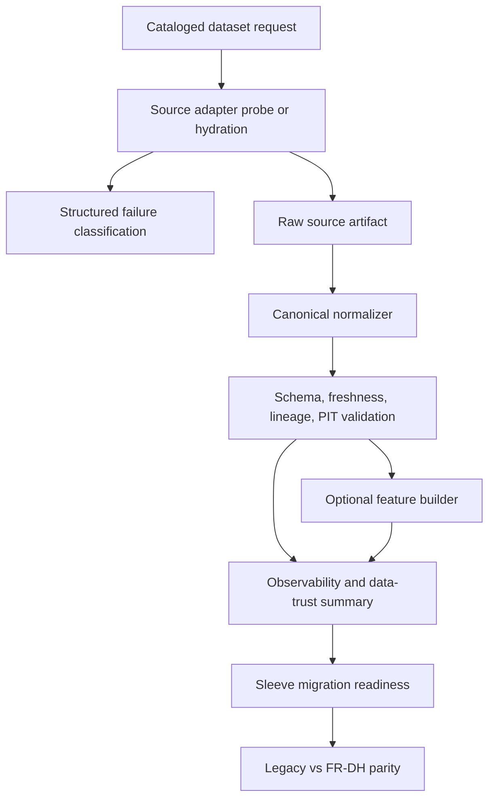
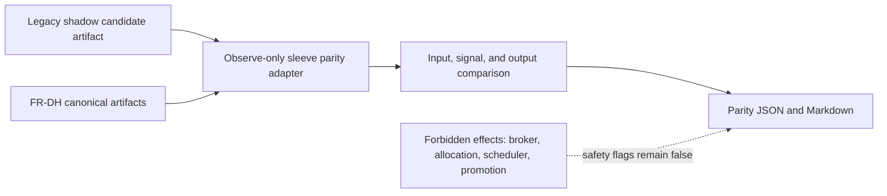

# Research Data Platform

This document is the technical retrospective for the FR-DH Research Data
Platform (RDP). It records why the platform was created, what was built, how
the architecture fits together, what remains incomplete, and how future
contributors should extend it without changing trading behavior by accident.
Its canonical status is `Needs Repository Verification` until the current
worktree state is committed and reconciled.

## Document Contract

| Field | Value |
|---|---|
| Purpose | Explain the FR-DH Research Data Platform architecture, observe-only boundary, and migration evidence. |
| Owner | `architecture` in front matter; repository verification still required. |
| Inputs | FR-DH governance package, research data implementation, hydration scripts, data tests, data artifacts. |
| Outputs | RDP retrospective and extension guidance. |
| Related Documents | `docs/governance/fr_active/data_hydration/fr_dh_000_data_hydration_index.md`, `docs/governance/fr_active/data_hydration/fr_dh_013_canonical_research_data_catalog.md`, `docs/architecture/DOCUMENT_GAPS.md`. |
| Related Tests | `Tests/test_data_hydration_*.py`, `Tests/test_sleeve_migration_readiness.py`, `Tests/test_sleeve_parity.py`. |
| Related Implementation | `research_data/`, `scripts/data_hydration/`. |
| Related Artifacts | `outputs/data_trust/`, data manifests, RDP hydration outputs. |
| Known Gaps | Current-worktree canonical status and production sleeve migration remain `Needs Repository Verification`. |

## 1. Executive Summary

Caerus historically used research data through a mix of sleeve-local files,
vendor-specific access paths, one-off probes, and ad hoc validation scripts.
That was useful for discovery, but it did not give future agents a reliable way
to answer whether a dataset was cataloged, point-in-time safe, fresh, validated,
lineage-tracked, or ready for sleeve migration.

FR-DH created a read-only Research Data Platform around canonical datasets. The
platform now has a catalog, source adapters, hydration swarm, normalization
layers, freshness manifests, validation commands, feature artifacts, research
API helpers, observability summaries, data-trust reporting, migration readiness,
and observe-only sleeve parity for core momentum sleeves. The RDP is not a
trading path. It does not submit broker orders, change allocations, promote
sleeves, mutate scheduler behavior, or replace production sleeve consumers.

The architecture deliberately separates research-data readiness from execution
readiness. RDP artifacts can prove that canonical data can reproduce legacy
candidate behavior in observe-only mode. Separate governance approval is still
required before any sleeve consumes RDP artifacts in production.

## 2. Historical Timeline

| Period | Architectural state | Consequence |
|---|---|---|
| Pre-FR-DH | Research datasets were consumed through sleeve-specific files, direct vendor assumptions, and local probes. | Fast iteration, but weak reproducibility and unclear PIT lineage. |
| FR-068 PIT foundation | The project proved survivorship and point-in-time universe issues were material for research conclusions. | Canonical PIT data became a prerequisite for decision-grade research. |
| FR-069 sleeve architecture | Sleeves gained governed research-stage lifecycle and evidence-envelope concepts. | Data readiness needed to become sleeve-independent and machine-readable. |
| FR-DH governance package | FR-DH-000 through FR-DH-013 defined catalog, source policy, freshness, normalization, observability, and migration rules. | The data platform moved from scattered decisions to governed artifacts. |
| Hydration and normalization implementation | `research_data/` and `scripts/data_hydration/` established adapters, raw artifacts, normalized artifacts, features, manifests, and validators. | Agents can hydrate and validate datasets without wiring them into trading. |
| Sleeve parity phase | Polaris, Lyra, and Orion observe-only parity compared legacy candidates against canonical RDP inputs. | The first core momentum sleeves reached parity evidence without runtime behavior change. |

## 3. Motivation

The platform was built to make research data an explicit institutional asset
instead of a hidden dependency. The immediate triggers were survivorship-bias
findings, PIT universe requirements, vendor-credential ambiguity, sample-scale
artifacts being mistaken for sleeve-ready coverage, and the need to compare
legacy sleeve candidates with canonical inputs before any migration.

The longer-term motivation is to let research and migration work proceed
without every future agent relearning vendor formats, path conventions, data
quality rules, or no-lookahead constraints.

## 4. Original Problems

- Dataset identity was not canonical. A "fundamentals" dataset could mean
  vendor raw rows, SEC company facts, a sleeve-local file, or derived features.
- Vendor-specific formats leaked into research logic.
- Freshness, coverage, validation, and lineage were not consistently surfaced
  together.
- Point-in-time safety was often documented in prose, not enforced by machine
  readable metadata.
- Sample probes and sleeve-grade coverage were easy to confuse.
- Missing data was often discovered late in parity or research workflows.
- There was no single internal API for research code to load canonical datasets.
- Migration readiness was advisory and manual, not artifact-backed.

## 5. Architectural Principles

- **Read-only first.** FR-DH artifacts may be generated and compared, but they
  must not change trading, execution, allocation, scheduling, promotion, or
  broker behavior.
- **Canonical before convenient.** Vendor formats are normalized before research
  consumers depend on them.
- **No uncataloged datasets.** After migration to canonical research data, no
  sleeve should depend on a dataset absent from the FR-DH catalog.
- **PIT safety is explicit.** Production-impacting datasets need date semantics,
  lineage, validation, freshness, and point-in-time safety metadata.
- **Graceful source failure.** Missing credentials, subscriptions, empty
  results, or unsupported sources should be classified and logged without
  failing unrelated datasets.
- **Deterministic artifacts.** JSON and Markdown outputs are stable,
  path-addressable, and suitable for audit.
- **Observe-only migration.** Legacy and canonical paths must be compared before
  any production consumer changes.

## 6. FR-DH Evolution

FR-DH started as a governance package under
`docs/governance/fr_active/data_hydration/`. FR-DH-000 became the index, and
FR-DH-013 became the canonical research data catalog. The implementation then
mapped that governance into code and artifacts:

- `research_data/catalog.py` defines the dataset catalog, required fields, and
  catalog rules.
- `data/manifests/research_data_catalog.json` materializes the catalog for
  validators and agents.
- `research_data/hydration.py` provides adapter and result primitives.
- `research_data/adapters/` contains source-specific read-only adapters.
- `research_data/normalization.py` implements P1, P2, and P3 canonical
  normalization.
- `research_data/features.py` builds derived feature artifacts.
- `research_data/api.py` exposes stable model-facing load helpers.
- `research_data/observability.py` and `research_data/data_trust.py` summarize
  platform state.
- `research_data/migration.py` and `research_data/parity.py` support
  observe-only sleeve migration analysis.

## 7. Research Data Platform Architecture

```mermaid
flowchart LR
    catalog["FR-DH catalog and source policy"]
    adapters["Read-only source adapters"]
    raw["data/raw"]
    normalized["data/normalized"]
    features["data/features"]
    manifests["data/manifests"]
    api["research_data API"]
    readiness["migration readiness"]
    parity["observe-only sleeve parity"]
    reports["operator reports"]

    catalog --> adapters
    adapters --> raw
    raw --> normalized
    normalized --> features
    normalized --> manifests
    features --> manifests
    manifests --> api
    api --> readiness
    readiness --> parity
    parity --> reports
```



The platform is implemented as an internal research-data layer. The source
adapters know about vendors and public endpoints. Normalized artifacts know
about canonical schemas. Research consumers should eventually know only about
`research_data` interfaces and canonical dataset identifiers.

## 8. Data Flow



Hydration writes raw artifacts and a freshness manifest. Normalization converts
raw rows into canonical rows and records source artifacts, hashes, generated
timestamps, as-of dates, validation results, and PIT status. Observability
combines catalog, freshness, normalization, feature, and validation state.
Migration readiness and parity consume those artifacts without touching trading.

## 9. Canonical Layers

| Layer | Purpose | Example paths |
|---|---|---|
| `raw/` | Source-shaped, read-only hydration output. | `data/raw/<dataset>/<source>/...` |
| `normalized/` | Dataset-shaped canonical rows with lineage and validation. | `data/normalized/prices/ohlcv_prices.json`, `data/normalized/security_master/security_master.json` |
| `features/` | Canonical derived features built from normalized inputs. | `data/features/fundamental_features/features.json`, `data/features/macro_regime_features/features.json` |
| `manifests/` | Catalog, freshness, capability, observability, and validation state. | `data/manifests/dataset_freshness.json`, `data/manifests/research_data_observability.json` |
| `outputs/research/` | Observe-only migration and parity reports. | `outputs/research/data_migration/<date>/...` |

Generated data artifacts remain research outputs and are not production trading
inputs. Large or regenerated artifacts should remain ignored unless a fixture,
template, or governance record explicitly belongs in source control.

## 10. Source Adapters

The adapter layer is intentionally narrow. Each adapter declares support for
specific cataloged dataset identifiers, produces a `HydrationResult`, and
classifies failures with machine-readable status values.

Implemented adapter families include:

- `nasdaq_sharadar`: optional paid Sharadar/Nasdaq Data Link probes for SEP,
  TICKERS, ACTIONS, SF1, and constituents.
- `yahoo_or_stooq`: public OHLCV and corporate-action samples.
- `sec_edgar`: SEC company tickers, company facts, submissions, Form 4, 8-K,
  10-Q, 10-K, and 13F-oriented probes.
- `fred`: macro rates, yield curve, and credit-spread samples.
- `cboe_or_vix`: VIX volatility-regime samples.
- `finra`, `polygon`, `news`, `public_reference`, and `derived`: scoped
  probes or explicit blocked/source-policy classifications.

Credentials are resolved outside the repo. The Nasdaq Data Link path checks
`NASDAQ_DATA_LINK_API_KEY` first and `QUANDL_API_KEY` as a legacy fallback.
Secrets must not be committed, printed, or embedded in artifacts.

## 11. Normalization

Normalization is split into stages so agents can reason about dependencies.

| Stage | Current datasets | Command surface |
|---|---|---|
| P1 | OHLCV prices, PIT security master, corporate actions, dataset freshness. | `scripts/data_hydration/normalize_p1.py` |
| P2 | Fundamentals, macro rates, yield curve, credit spreads, VIX regime. | `scripts/data_hydration/normalize_p2.py` |
| P3 | Insider Form 4, SEC event metadata, ETF/index constituents, 13F, news metadata. | `scripts/data_hydration/normalize_p3.py` |

P1 is the sleeve-readiness foundation for core momentum parity. The current
security-master implementation distinguishes PIT-grade Sharadar/TICKERS
date-window coverage from SEC current-reference fallback coverage and from
sample-only coverage. That distinction prevents a current-reference security
master from masquerading as migration-ready PIT data.

## 12. Feature Store

The feature store is observe-only and canonical. It currently focuses on:

- `fundamental_features`: net margin, positive revenue, and positive profit
  features derived from normalized `fundamentals_pit`.
- `macro_regime_features`: yield-curve inversion, credit stress, high
  volatility, and 10-year rate level features derived from normalized macro and
  volatility inputs.

Feature artifacts record input dataset identifiers, schema versions, feature
definitions, feature versions, generated timestamps, and PIT status. The feature
store is not wired into live sleeve execution.

## 13. Freshness

Freshness is represented in both source-level and canonical forms:

- `data/manifests/dataset_freshness.json` captures hydration and source status.
- `data/normalized/freshness/dataset_freshness.json` normalizes freshness rows
  for the research API and migration validators.
- `research_data/observability.py` joins freshness with normalization,
  validation, lineage, artifact hashes, and catalog metadata.

Freshness validators block readiness when required rows are missing for core
P1 datasets. Missing freshness for optional or blocked datasets is surfaced as a
warning or blocker according to catalog status and sleeve requirements.

## 14. Validation

Validation exists at multiple levels:

- Catalog validation checks required fields, duplicate dataset identifiers, and
  FR-DH catalog rules.
- Hydration validation checks capability and source-result classification.
- Normalization validation checks required canonical fields, row counts, date
  semantics, lineage, and PIT status.
- Feature validation checks definitions, input artifacts, and derived rows.
- Observability and data-trust validation check complete reporting surfaces.
- Sleeve migration and parity validation check that canonical artifacts are not
  sample-only, stale, missing symbols, or missing required freshness rows.

Validation is intentionally evidence-producing rather than behavior-changing.
Failing validation should block migration recommendations, not trigger runtime
trading changes.

## 15. Observability

RDP observability is designed for daily machine inspection. Dataset rows report:

- readiness status
- tier and domain
- normalization stage
- artifact existence and SHA-256
- row count
- source artifact count and hashes
- freshness status
- validation status and errors
- lineage status
- PIT-safe status
- blocker reason

The data-trust summary converts observability into an operator-readable JSON and
Markdown report with critical, warning, and informational findings. It explicitly
records that broker submission, dashboard mutation, and email send are not
invoked by the summary builder.

## 16. Research API

The internal API in `research_data/api.py` is the stable read surface. It
exposes generic and dataset-specific helpers, including:

- `load_dataset()`
- `load_dataset_with_diagnostics()`
- `load_research_data_observability()`
- `load_data_trust_summary()`
- `load_prices()`
- `load_security_master()`
- `load_corporate_actions()`
- `load_fundamentals()`
- `load_macro()`
- `load_yield_curve()`
- `load_credit_spreads()`
- `load_vix()`
- `load_insiders()`
- `load_sec_events()`
- `load_features()`
- `load_constituents()`
- `load_institutional_holdings()`
- `load_news_metadata()`

Future sleeve code should call these interfaces after explicit migration
approval instead of reading vendor-specific artifacts directly.

## 17. Migration Readiness

Migration readiness is advisory and observe-only. It answers whether a sleeve
has the canonical datasets, symbol coverage, freshness, lineage, validation, and
PIT status required for a safe comparison.

The primary artifacts are:

- `outputs/research/data_migration/<date>/migration_readiness.json`
- `outputs/research/data_migration/<date>/migration_readiness.md`

Readiness must distinguish dataset-level availability from symbol-level
coverage. A dataset can be normalized and still be unsuitable for a sleeve if it
does not cover that sleeve's required symbols or if freshness rows are missing.

## 18. Sleeve Parity

Sleeve parity compares legacy candidates with canonical FR-DH inputs and output
semantics without promoting or wiring a sleeve. Current parity tooling produces:

- `outputs/research/data_migration/<date>/sleeve_parity_<sleeve>.json`
- `outputs/research/data_migration/<date>/sleeve_parity_<sleeve>.md`
- `outputs/research/data_migration/<date>/core_momentum_parity_summary.json`
- `outputs/research/data_migration/<date>/core_momentum_parity_summary.md`

As of the 2026-06-24 observe-only artifacts, Polaris, Lyra, and Orion have
core momentum parity status `PASS`, with `broker_submission_invoked=false`,
`sleeve_runtime_invoked=false`, `allocation_mutation_invoked=false`, and
`promotion_invoked=false`. The parity layer is therefore evidence of canonical
input equivalence, not evidence of production migration.



## 19. Current Dataset Inventory

| Dataset | Tier | Domain | Current RDP state | Remaining concern |
|---|---|---|---|---|
| `ohlcv_prices` | 1 | prices | P1 normalized, freshness tracked, used in core momentum parity. | Public sample source needs vendor audit before production impact. |
| `security_master_pit` | 1 | security master | P1 normalized with Sharadar/TICKERS PIT-grade date-window status where available. | Symbol-change and delisting semantics should keep being audited as coverage expands. |
| `corporate_actions` | 1 | corporate actions | P1 normalized and freshness tracked. | Public chart-event sample needs action-type and vendor lineage audit. |
| `dataset_freshness` | 1 | metadata | Normalized from hydration metadata. | Must remain complete for all required sleeve datasets. |
| `fundamentals_pit` | 2 | fundamentals | Sharadar/SF1 probe path and P2 normalization exist. | Restatement and filing-date semantics need fuller production audit. |
| `fundamental_features` | 2 | features | Observe-only feature artifacts exist. | Feature definitions are initial and not sleeve-promoted. |
| `macro_rates` | 2 | macro | P2 normalization exists from public macro source. | Release-date PIT status remains observe-only where release dates are unavailable. |
| `yield_curve` | 2 | macro | P2 normalization and macro-regime feature input exist. | Release-date PIT status remains observe-only where release dates are unavailable. |
| `credit_spreads` | 2 | macro | P2 normalization and macro-regime feature input exist. | Release-date PIT status remains observe-only where release dates are unavailable. |
| `vix_volatility_regime` | 2 | volatility | P2 normalization and macro-regime feature input exist. | Source lineage should be expanded before production impact. |
| `etf_index_constituents` | 2 | constituents | Sharadar probe and P3 normalization path exist. | Needs fuller date-effective membership audit. |
| `insider_form4` | 3 | insiders | SEC adapter and P3 normalization path exist. | Sleeve use requires event taxonomy and coverage hardening. |
| `sec_8k_events` | 3 | SEC events | SEC adapter and P3 normalization path exist. | Item taxonomy and acceptance-time semantics need expansion. |
| `sec_10q_10k_metadata` | 3 | SEC events | SEC adapter and P3 normalization path exist. | Filing metadata should be reconciled against downstream fundamentals needs. |
| `institutional_13f` | 3 | institutional holdings | SEC adapter and P3 normalization path exist. | 13F reporting lag must remain explicit in features. |
| `short_interest` | 3 | short interest | Cataloged and policy-classified. | Source or license decision remains before Phoenix-grade use. |
| `options_iv_open_interest` | 4 | options | Cataloged and policy-classified. | Requires approved options vendor and PIT validation plan. |
| `analyst_estimate_revisions` | 4 | analyst estimates | Cataloged and policy-classified. | Requires vendor/business decision. |
| `news_metadata` | 4 | news | Public/news adapter path and P3 normalization path exist. | Needs source quality, licensing, and timestamp audit. |
| `news_sentiment_embeddings` | 4 | news features | Cataloged and explicitly blocked pending approved embedding path. | Requires model/vendor and reproducibility decision. |
| `alternative_datasets` | 4 | alternative data | Cataloged as experimental. | Each dataset needs separate legal, vendor, and PIT review. |

## 20. Remaining Gaps

- RDP is observe-only. No sleeve has been promoted to consume canonical RDP
  artifacts in production.
- Some normalized datasets are still sample-scale or source-limited.
- Several datasets need external vendor, licensing, or business decisions.
- Full historical PIT semantics for symbol changes, delistings, restatements,
  and index membership require continued audit as coverage expands.
- Macro release-date semantics remain weaker where public sources do not expose
  release timestamps.
- Feature definitions are initial and should be versioned through governance
  before sleeve adoption.
- Generated artifacts need repeatable daily refresh discipline before they can
  be used as operational evidence.

## 21. Future Expansion Strategy

Future RDP expansion should follow this order:

1. Update the FR-DH catalog before adding, changing, or retiring a dataset.
2. Add or extend a read-only source adapter with credential-safe failure
   classification.
3. Hydrate raw sample artifacts and confirm source capability.
4. Normalize into the canonical schema with as-of, effective, filing, lineage,
   validation, and PIT metadata.
5. Add validators that distinguish missing data, sample-only coverage,
   current-reference fallback, and true PIT-grade readiness.
6. Add feature definitions only after normalized inputs are stable.
7. Update observability and data-trust summaries.
8. Update migration readiness requirements for the consuming sleeves.
9. Run observe-only parity before proposing any consumer migration.

## 22. Lessons Learned

- Governance intent is not enough. Agents need machine-readable artifacts and
  validators to avoid repeating old assumptions.
- PIT safety must be represented as data, not just prose.
- Sample success is not coverage readiness.
- Vendor access should be optional and explicitly classified; missing credentials
  should not make unrelated datasets fail.
- The safest migration path is comparison first, promotion later.
- Artifacts need negative flags such as `broker_submission_invoked=false` because
  safety is easier to audit when forbidden effects are explicit.
- A canonical research API prevents vendor-specific formats from leaking back
  into sleeves.

## 23. Operational Guidance

Use focused, read-only commands when refreshing or diagnosing RDP state. Example
commands:

```bash
.venv/bin/python scripts/data_hydration/run_data_hydration_swarm.py \
  --env-file ~/.caerus/nasdaq_data_link.env \
  --limit-sample \
  --datasets ohlcv_prices security_master_pit corporate_actions dataset_freshness \
  --sources yahoo_chart_public nasdaq_sharadar internal_dataset_freshness
```

```bash
.venv/bin/python scripts/data_hydration/normalize_p1.py --as-of-date YYYY-MM-DD
.venv/bin/python scripts/data_hydration/normalize_p2.py --as-of-date YYYY-MM-DD
.venv/bin/python scripts/data_hydration/normalize_p3.py --as-of-date YYYY-MM-DD
.venv/bin/python scripts/data_hydration/build_feature_store.py --as-of-date YYYY-MM-DD
.venv/bin/python scripts/data_hydration/build_research_data_observability.py --as-of-date YYYY-MM-DD
.venv/bin/python scripts/data_hydration/build_data_trust_summary.py
.venv/bin/python scripts/data_hydration/build_sleeve_migration_readiness.py --as-of-date YYYY-MM-DD
```

```bash
.venv/bin/python -m scripts.data_hydration.run_sleeve_parity --sleeve polaris
.venv/bin/python -m scripts.data_hydration.run_sleeve_parity --sleeve lyra
.venv/bin/python -m scripts.data_hydration.run_sleeve_parity --sleeve orion
.venv/bin/python -m scripts.data_hydration.run_core_momentum_parity_summary --as-of-date YYYY-MM-DD
```

Before any future production migration proposal, confirm:

- the dataset is cataloged in FR-DH-013 and `research_data/catalog.py`
- normalized artifacts exist for required dates and symbols
- freshness rows exist for every required dataset
- validation status is `PASS` or explicitly justified
- PIT status is appropriate for the sleeve decision being made
- migration readiness is not blocked
- observe-only parity passes for current-date legacy candidates
- no artifact reports broker submission, allocation mutation, scheduler mutation,
  sleeve runtime invocation, or promotion invocation

Runtime impact: this architecture record is documentation-only. It does not
change trading behavior, broker execution, scheduler behavior, allocation,
promotion state, model behavior, or sleeve runtime consumers.
