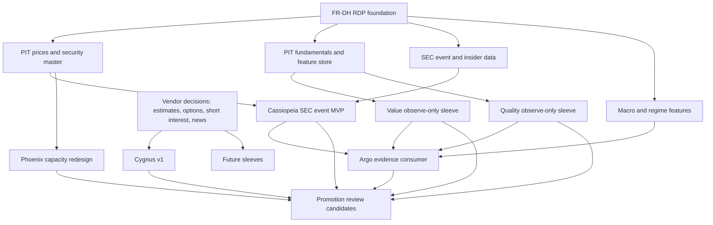

# Post-RDP Strategic Assessment

Status: Strategic decision document

Execution impact: none. This document does not approve production trading,
broker submission, scheduler changes, allocation changes, sleeve promotion, or
runtime consumer migration.

## Executive Decision

The Research Data Platform foundation changes the next Caerus priority from
infrastructure construction to investment intelligence. The next six months
should focus on producing differentiated, point-in-time, decision-grade research
evidence from canonical data, not on adding more platform scaffolding or
promoting sleeves prematurely.

The recommended six-month build program is:

1. Build a public, PIT-safe Cassiopeia SEC-event MVP around activist 13D and
   related SEC event tapes.
2. Convert Value and Quality from feature availability into observe-only
   canonical research candidates using PIT fundamentals and canonical feature
   artifacts.
3. Harden Argo as an evidence consumer and research-priority engine, not as an
   allocator.
4. Reassess Phoenix only through a capacity-aware thesis redesign or formal
   hold decision.
5. Defer Cygnus v1, analyst revisions, options, sentiment, and alternative data
   until source and vendor decisions are explicit.

The strategy is to spend limited engineering capacity where the RDP has already
made data available and where differentiated return streams can be evaluated
without vendor lock-in.

## Current Strategic Baseline

- Core momentum sleeves now have observe-only FR-DH parity evidence.
- The RDP provides cataloged hydration, normalization, freshness, validation,
  feature artifacts, observability, migration readiness, and parity surfaces.
- Phoenix has decision-grade adverse capacity evidence for the current Phase B
  candidate and is not shadow-readiness eligible.
- Cassiopeia remains research-stage and differentiated by thesis, with the
  fastest public PIT path through SEC-derived event tapes.
- Cygnus v0 is shelved, and Cygnus v1 depends on EPS surprise or consensus data.
- Argo is an advisory evidence and regime layer, not a security selector and not
  an allocator.
- Value and Quality are now more practical because canonical fundamentals and
  feature artifacts exist, but they are not yet governed sleeves.

## Strategic Scoring Method

Ratings are relative and intended for sequencing:

- Alpha potential: Low, Medium, High, Very High.
- Engineering complexity: Low, Medium, High.
- Data dependency complexity: Low, Medium, High.
- Vendor dependency: None, Low, Medium, High.
- Cost: Internal, Low, Medium, High.
- Effort: S, M, L, XL.
- Operational risk: Low, Medium, High.
- Promotion impact: how much the work can improve promotion readiness or
  portfolio construction decisions.

## Sleeve and Initiative Assessment

| Initiative | Expected alpha potential | Engineering complexity | Data dependency complexity | Vendor dependency | Cost | Estimated implementation effort | Operational risk | Promotion readiness impact | Research value | Estimated timeline | Recommended sequencing |
|---|---|---|---|---|---|---|---|---|---|---|---|
| Phoenix | High if capacity-safe; currently impaired | Medium | Medium | Low after Sharadar unblock | Low to medium | M for redesign, L for full retest | Medium because crisis signals can be sparse and unstable | Medium only if capacity blocker is resolved | High for diversification, but current candidate failed capacity | 4-8 weeks for redesign decision; 3-4 months for full retest | Rank 5: redesign or formal hold, no shadow path until capacity clears |
| Cassiopeia | High | Medium | Medium | Low for SEC MVP; high for analyst/index expansion | Low for SEC MVP | M for 13D MVP, L for broader event sleeve | Low while research-only; medium if event taxonomy expands | High if event evidence is decision-grade and low overlap | Very high because it creates a differentiated catalyst family | 4-8 weeks for SEC MVP; 3-6 months for broader tape | Rank 1: first post-RDP alpha build |
| Cygnus | Medium to high for v1; v0 failed | Medium | High | High for consensus/surprise | Medium to high | M after vendor; L before promotion evidence | Low while shelved; medium if reactivated | Medium, but blocked by input data | Medium until vendor decision; high after valid consensus data | Vendor decision first; 3-6 months after source approval | Rank 8: defer until estimates vendor decision |
| Argo | Medium directly; high as portfolio intelligence | Medium | Medium | Low | Internal to low | M | Medium if misused as allocator; low as advisory evidence layer | High for governance and capital-allocation discipline | High because it ranks evidence across sleeves | 4-10 weeks for next evidence layer | Rank 3: build as advisory evidence consumer only |
| Value | Medium to high | Medium | Medium | Medium through PIT fundamentals | Low if Sharadar is sufficient | M to L | Low while observe-only | Medium, especially for diversification away from momentum | High because canonical fundamentals now exist | 6-10 weeks for observe-only prototype | Rank 3 tied: build after Cassiopeia MVP starts |
| Quality | Medium | Medium | Medium | Medium through PIT fundamentals | Low if Sharadar is sufficient | M | Low while observe-only | Medium; may improve core sleeve robustness more than diversification | High as core intelligence, medium as standalone alpha | 6-10 weeks for observe-only prototype | Rank 4: pair with Value but guard against Polaris overlap |
| Future sleeves | Variable | Medium to high | Variable | Variable | Variable | M to XL | Low if kept in FR-069 research lifecycle | Medium only after evidence envelope exists | Medium, useful for option generation | Continuous intake, quarterly selection | Rank 10: maintain intake, do not expand before evidence backlog clears |

## Initiative-Specific Conclusions

### Phoenix

Phoenix remains differentiated by thesis, but the current candidate set failed
the 5 percent ADV capacity policy at the reference capital level. That is not a
platform blocker anymore; it is a strategy viability blocker. The next Phoenix
work should be one of two explicit choices:

- redesign Phoenix as a capacity-aware crisis sleeve with larger, more liquid
  dislocation candidates and pre-registered capacity gates; or
- hold Phoenix until a new crisis-reversal hypothesis is approved.

Do not spend the next cycle tuning thresholds to make the current failed shape
pass. That would weaken research integrity.

### Cassiopeia

Cassiopeia is the best next alpha build because it is differentiated, public
data can support a PIT-safe MVP, and it benefits directly from the RDP event and
security-master foundation. The first implementation should avoid analyst
actions and index changes, because those are source-gated. The clean MVP is:

- activist 13D and 13D/A event tape;
- acceptance timestamp and tradable-date contract;
- issuer and security-id join;
- campaign-level dedupe;
- liquidity and capacity filters;
- event-window forward-return evidence;
- overlap study against Polaris, Orion, Lyra, Phoenix, Cygnus, and SPY.

This is the highest-ROI path because it turns an existing event-driven thesis
into a measurable research tape without a new vendor.

### Cygnus

Cygnus v0 should stay shelved. It already failed pre-registered v0 validation,
and retuning would consume research credibility. Cygnus v1 is attractive only
after Caerus has a PIT-safe consensus, surprise, or estimate-revision source.
Until that source is approved, Cygnus should remain a research-only design
candidate with no new implementation except source evaluation.

### Argo

Argo should be built as an evidence operating system, not as a hidden allocator.
The useful next Argo work is to consume canonical RDP diagnostics, sleeve parity,
shadow observation, and evidence envelopes to answer:

- which sleeves have decision-grade data;
- which return streams are differentiated;
- which blockers are data, model, capacity, or governance blockers;
- which research tasks have the highest expected value.

Argo should not change capital weights, select securities, retire sleeves, or
promote candidates without explicit governance approval.

### Value

Value is newly attractive because PIT fundamentals and canonical fundamental
features exist. It should be treated as an observe-only sleeve candidate, not as
an immediate extension of Polaris. The MVP should test valuation spreads,
quality-adjusted value, sector-neutral ranking, liquidity filters, and overlap
against core momentum.

The main risk is stale or restated fundamentals leaking look-ahead bias. Value
should wait for a hardened restatement/version policy before any promotion
claim.

### Quality

Quality has high research value, but it may be less diversifying than
Cassiopeia or Phoenix because Polaris already has quality-like characteristics.
Quality should be built as:

- a canonical feature validation layer;
- a standalone observe-only sleeve;
- a diagnostic challenge to Polaris factor attribution.

Its promotion value is highest if it explains or improves core momentum
resilience, not if it becomes a duplicate core sleeve.

### Future Sleeves

Future sleeves should enter through the FR-069 lifecycle only after they have:

- a distinct return driver;
- a cataloged data dependency set;
- a PIT-safe evidence path;
- expected capacity;
- overlap expectations;
- explicit non-goals;
- a clear source policy.

The platform should avoid a broad sleeve explosion while the current alpha
frontier still has unresolved, higher-ROI work.

## Explicit Dependency Graph

The graph implies that Cassiopeia, Value, Quality, and Argo can proceed with
limited new vendor decisions. Cygnus, analyst-heavy Cassiopeia variants,
options, sentiment, and some future sleeves should wait for source decisions.

## Dataset Assessment

| Dataset | Free availability | Paid availability | Recommended source | Difficulty | Maintenance burden | Estimated alpha contribution | Recommendation |
|---|---|---|---|---|---|---|---|
| Short Interest | Partial through FINRA/exchange sources, but schema and publication lag need review | Available through market-data vendors | Source decision required; start with FINRA feasibility audit | Medium | Medium | Medium for crowded-short, squeeze, and Phoenix-style stress context | Research only; source/schema decision before implementation |
| Analyst Revisions | Weak free availability; public news is not enough for PIT revisions | Strong through estimates vendors | Paid estimates vendor or Polygon candidate only after business decision | High | High | High for Cygnus v1 and Cassiopeia analyst events | Defer until vendor decision |
| Options | Limited free delayed data; insufficient for robust IV/OI history | Strong through Polygon, CBOE, OptionMetrics-style vendors | Paid options source only if an options research program is approved | High | High | Medium to high for sentiment, crash risk, and volatility overlays | Defer; keep design-only |
| Insider Transactions | Strong free SEC availability | Vendor mirrors can simplify parsing | SEC Form 4 first, vendor mirror optional later | Medium | Medium | Medium for event and quality overlays | Quick win after Cassiopeia MVP foundation |
| SEC Events | Strong free SEC availability | Vendor parsed feeds available | SEC submissions and filing documents first | Medium | Medium | High for Cassiopeia event tape and Cygnus event controls | High ROI; build public event tape first |
| Macro | Strong free availability from FRED, Treasury, and public volatility sources | Paid macro feeds optional | FRED/Treasury/CBOE public sources with release-date policy | Low to medium | Low | Medium for Argo and risk context | Quick win; harden release-date semantics |
| Alternative Data | Usually weak or legally complex | Vendor-specific | None by default | High | High | Unknown; potentially high but unproven | Defer until named dataset passes legal/source review |
| News | Public metadata available through GDELT-style sources; quality varies | Paid news feeds available | GDELT for smoke only; paid source if news becomes core | Medium | High | Medium for event detection, low without robust timestamp and entity resolution | Research only; do not make core dependency yet |
| Sentiment | Free sentiment is reproducibility-risky without model governance | Paid sentiment feeds or internal model pipeline | Internal versioned model only after news metadata is approved | High | High | Unknown to medium | Defer; design PIT-safe model versioning first |

## Ranked Remaining Initiatives

| Rank | Initiative | Category | Why |
|---:|---|---|---|
| 1 | Cassiopeia SEC-event MVP | High ROI | Public PIT-safe path, differentiated alpha, low vendor dependency. |
| 2 | SEC event and insider parser hardening | Quick win | Shared data foundation for Cassiopeia, Cygnus controls, and future event sleeves. |
| 3 | Value observe-only prototype | High ROI | RDP fundamentals make this newly practical; diversification potential is meaningful. |
| 4 | Quality observe-only prototype | Quick win / High ROI | Useful for core attribution and robustness, but needs overlap discipline. |
| 5 | Argo evidence consumer v2 | High ROI / Research only | Turns RDP and sleeve evidence into portfolio intelligence without allocation changes. |
| 6 | Macro release-date and regime hardening | Quick win | Supports Argo and risk context with low vendor dependency. |
| 7 | Phoenix capacity-aware redesign decision | Research only | Strong thesis, but current candidate failed capacity; redesign must precede retest. |
| 8 | Short interest source feasibility | Research only | Useful but not yet source-approved; likely relevant to Phoenix and crowding. |
| 9 | Cygnus v1 source decision | Long-term bet | Attractive if PIT consensus/surprise data is approved; blocked until then. |
| 10 | News metadata entity-resolution research | Research only | Potential event-detection value, but timestamp and entity quality are not solved. |
| 11 | Analyst revisions | Defer | High alpha relevance but vendor-gated and maintenance-heavy. |
| 12 | Options IV/OI | Defer / Long-term bet | Potentially useful, but expensive, complex, and unrelated to immediate sleeve readiness. |
| 13 | Sentiment embeddings | Defer | Requires news governance plus model versioning before it can be trusted. |
| 14 | Alternative data | Defer | No named source or legal review; avoid generic alternative-data work. |
| 15 | New future sleeves beyond current roadmap | Defer | Intake can continue, but new sleeve construction should wait for current evidence backlog. |

## Quick Wins

- Build Cassiopeia 13D/13D/A event tape with availability timestamps.
- Harden SEC event and insider source normalization around accession-level
  lineage.
- Build macro release-date policy and regime-feature validation.
- Create observe-only Value and Quality feature panels from existing
  fundamental feature artifacts.
- Add Argo evidence summaries that consume RDP observability, parity, and
  migration readiness.

## High ROI

- Cassiopeia public SEC-event MVP.
- Value and Quality observe-only sleeves.
- Argo research-priority and evidence-consumer layer.
- SEC event parser hardening.
- Phoenix capacity-aware redesign decision.

## Long-Term Bets

- Cygnus v1 after estimates/consensus data approval.
- Options IV/OI research after vendor and symbology decisions.
- News metadata and entity-resolution system.
- Sentiment embeddings with strict model-version governance.
- Named alternative datasets after legal/source review.

## Research Only

- Argo evidence scoring.
- Phoenix redesign analysis.
- Short interest source feasibility.
- News metadata smoke tests.
- Future sleeve intake and evidence-envelope triage.

## Defer

- Analyst revisions until a vendor and budget decision exists.
- Options IV/OI until an options research program is approved.
- Sentiment embeddings until news metadata is trusted and model governance is
  defined.
- Alternative data until a named dataset has legal, PIT, cost, and maintenance
  review.
- Any promotion or allocation change based solely on RDP parity.

## What Should Caerus Spend The Next Six Months Building?

Caerus should spend the next six months building an investment-intelligence
loop:

1. Canonical event intelligence from free, PIT-safe SEC data.
2. Canonical fundamental intelligence through Value and Quality observe-only
   sleeves.
3. Advisory portfolio intelligence through Argo evidence scoring.
4. Capacity-aware viability decisions for Phoenix.
5. Explicit vendor decisions for estimates, short interest, options, and news.

This path uses the RDP where it is already strongest, creates differentiated
alpha evidence, and avoids spending the next cycle on high-cost vendor work
before public-source opportunities are exhausted.

## 3-Month Roadmap

| Month | Focus | Deliverables |
|---|---|---|
| 1 | Cassiopeia SEC MVP and shared event data | 13D/13D/A tape, acceptance timestamp contract, campaign dedupe, initial event-study artifact. |
| 1-2 | Value and Quality observe-only prototypes | Canonical factor definitions, PIT fundamental feature panels, overlap reports versus Polaris/Orion/Lyra. |
| 2 | Argo evidence consumer v2 | RDP observability ingestion, sleeve-evidence ranking, blocker taxonomy, research ROI scoring. |
| 2-3 | Macro and SEC hardening | Release-date policy, SEC accession lineage, data freshness and validation improvements. |
| 3 | Phoenix decision checkpoint | Redesign proposal or formal hold recommendation based on capacity-aware constraints. |

## 6-Month Roadmap

| Quarter | Focus | Deliverables |
|---|---|---|
| Q1 | Public-source alpha evidence | Cassiopeia MVP, Value prototype, Quality prototype, Argo evidence ranking. |
| Q2 | Evidence maturation | Event tape expansion, insider transaction parser, Value/Quality robustness, Argo portfolio-intelligence report. |
| Q2 | Source decisions | Go/no-go decisions for analyst revisions, short interest, options, and paid news. |
| Q2 | Promotion preconditions | Identify which candidates deserve deeper shadow-readiness work; no automatic promotion. |

## 12-Month Roadmap

| Horizon | Focus | Deliverables |
|---|---|---|
| 6-9 months | Candidate consolidation | Decide whether Cassiopeia, Value, or Quality have enough evidence for shadow-readiness review. |
| 6-9 months | Vendor-gated research | If approved, build Cygnus v1 estimates/consensus tape and short-interest features. |
| 9-12 months | Portfolio intelligence | Argo produces stable advisory capital-allocation research reports, still non-executing unless separately approved. |
| 9-12 months | Long-term bets | Options, sentiment, news, and alternative data proceed only if their source decisions clear. |

## Decision Rules For Future Work

- Do not promote a sleeve because RDP parity passes; parity proves data-path
  equivalence, not alpha quality.
- Do not build a vendor-gated sleeve until the vendor, cost, licensing,
  freshness, and PIT policy are approved.
- Do not retune failed research to pass old gates without an explicit new
  hypothesis.
- Prefer public, timestamped, PIT-safe event data before paid unstructured data.
- Keep Argo advisory until a separate governance decision authorizes allocation
  behavior.
- Require every new initiative to state expected alpha source, required
  datasets, PIT contract, capacity expectation, overlap hypothesis, and
  promotion gate before implementation.

## Final Recommendation

The next strategic phase should be named "Investment Intelligence Phase 1".
Its objective is not more infrastructure. Its objective is to convert the RDP
foundation into decision-grade research evidence across three differentiated
families:

- event-driven alpha through Cassiopeia;
- fundamental alpha through Value and Quality;
- portfolio evidence intelligence through Argo.

Phoenix remains valuable but must be treated as a capacity-redesign problem.
Cygnus, analyst revisions, options, sentiment, and alternative data remain
longer-term or vendor-gated bets.

Runtime impact: documentation-only strategic assessment. No execution, broker,
scheduler, allocation, sleeve promotion, model behavior, dashboard behavior, or
production data-consumer behavior is changed.
