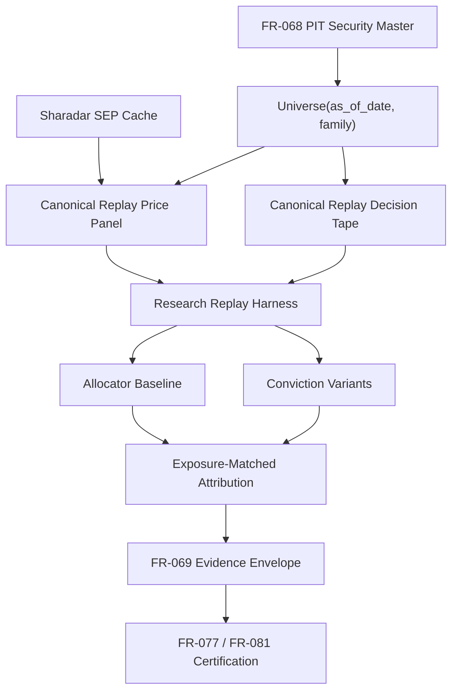

# Canonical PIT Replay Program - Phase 1 Gate

Date: 2026-06-22
Scope: Research infrastructure audit and phase gate
Governance label: RESEARCH_ONLY / NON_EXECUTIONAL
Runtime impact: none
Final status: BLOCKED

Supersession note 2026-06-22: the specific `Universe(as_of_date, "caerus_large_cap")`
resolver blocker identified in this gate was corrected and certified in
`reports/pit_universe_certification.md`. The broader decision-grade replay program
remains blocked at Phase 6 because the current large-cap family still uses current
`scalemarketcap`, not date-effective DAILY market cap.

## Executive Summary

Phase 1 found that the FR-068 PIT foundation is useful and materially better than the legacy current-universe path, but the canonical allocator replay surface is not yet decision-grade.

The program must stop before conviction-allocation rebaseline, sleeve-promotion rebaseline, or any allocator conclusion. The stop condition is not "FR-068 is useless." The more precise conclusion is:

FR-068 identity, delisting existence, symbol history, security-existence universe, large-cap family artifact, and SEP price hydration are substantially complete for existing PIT rebaseline research. However, decision-grade allocator replay is blocked because the replay path is not yet canonical, not fully security_id keyed, not certified, and not tied to a working per-date `Universe(as_of_date, "caerus_large_cap")` contract.

No production allocator, paper trading, live trading, execution, broker, scheduler, or promotion behavior was changed.

## Correct FR Assignment

| Item | Decision |
| --- | --- |
| Existing owner for PIT data foundation | FR-068 |
| Existing owner for canonical replay harness | FR-069 child workstream |
| New FR required now | No |
| Reserve standalone FR if governance later requires it | FR-105 |
| Do not reuse | FR-074 |
| Data-trust dependency | FR-077 |
| Universe/security-master integrity dependency | FR-081 |
| Forward evidence-window dependency | FR-101 |

Rationale:

- FR-068 owns PIT universe and survivorship remediation.
- FR-069 already defines the Research Lab architecture: one PIT data layer, one backtest/validation harness, sleeve contracts, evidence envelopes, and governance gates.
- FR-074 is already assigned to execution reliability. Existing `fr074_pit_conviction_replay` artifacts are misnumbered lineage-only for this program.
- FR-105 should not be opened unless governance explicitly decides this cross-cuts beyond the FR-069 child ownership model.

## Phase Gate Decision

| Phase | Gate | Decision |
| --- | --- | --- |
| Phase 1 - FR-068 infrastructure audit | Inventory complete enough to assess replay readiness | PASS |
| Phase 2 - Canonical replay architecture | Proceed only if blockers are resolved or scope is limited to design/certification scaffolding | NO-GO for decision-grade replay |
| Phase 3 - Canonical allocator baseline | Requires Phase 2 certified replay artifacts | BLOCKED |
| Phase 4 - Exposure-matched framework | Requires certified baseline and replay tape | BLOCKED |
| Phase 5 - Decision-grade validation | Requires certification contract plus artifacts | BLOCKED |
| Phase 6 - Conviction allocation rebaseline | Requires Phase 5 PASS | BLOCKED |
| Phase 7 - Sleeve promotion rebaseline | Requires Phase 5 PASS | BLOCKED |
| Phase 8 - Program hardening | Requires canonical paths to enforce | BLOCKED |

Go/no-go: NO-GO for Phase 2 decision-grade replay and all downstream research re-runs.

## Infrastructure Inventory

| Component | Status | Evidence | Decision-grade gap |
| --- | --- | --- | --- |
| PIT security master | Complete for current FR-068 scope | `data/pit_universe/security_master.csv`; `data/pit_universe/manifest.json`; FR-068 readiness reports 20,618 securities | Needs replay certification linkage |
| Delisted security inclusion | Complete for existence dates | FR-068 readiness shows 14,790 delisted securities and 354 delisted large-cap names hydrated | Delisting events lack reason/action/terminal return enrichment |
| Symbol history | Complete for identity audit | `data/pit_universe/symbol_history.csv` | Needs replay identity tests across ticker changes |
| `Universe(as_of_date)` default family | Complete for `sharadar_security_existence` | `research/pit_universe.py` refuses `data/universe.csv` fallback | Does not currently resolve `caerus_large_cap` |
| `Universe(as_of_date, "caerus_large_cap")` | Missing in canonical resolver | Local check: `2014-01-02` returned 0 while file as-of membership is 1,197; `2026-01-02` returned 0 while file as-of membership is 1,260 | Wire family file into canonical resolver or merge family rows into canonical membership table |
| `caerus_large_cap` membership artifact | Partial | 1,600 rows, 354 delisted, 1,246 active | Uses current `scalemarketcap`; DAILY market cap is PIT-exact source |
| Sharadar SEP hydration | Complete for current large-cap artifact | 1,600/1,600 hydrated; 354/354 delisted hydrated; date range 1997-12-31 to 2026-06-09 | Needs security_id keyed canonical replay panel and aggregate diagnostics |
| Canonical replay price panel | Missing | Existing rebaseline scripts load ticker CSV files directly | Need long panel keyed by `date, security_id` with source hashes |
| Canonical replay decision tape | Missing | Existing artifacts are summary-oriented or short shadow snapshots | Need `trade_date, security_id, sleeve, rank, score, target_weight` |
| Canonical allocator baseline | Missing | Conviction research used `current_artifact_target_proxy` | Need research-only parity baseline for `PortfolioAllocator` semantics |
| Exposure-matched attribution | Missing | Prior best conviction result had lower cash than current proxy | Need matched and unmatched exposure views |
| Replay certification | Missing | Evidence validators certify sleeve envelopes, not replay artifacts | Need fail-closed replay validator |

## Key Local Facts

1. `research/pit_universe.py` defines `Universe(as_of_date)` as the canonical PIT interface and explicitly refuses fallback to `data/universe.csv`.
2. `Universe("2014-01-02", "caerus_large_cap")` currently returns 0, while `membership_universe_large_cap.csv` contains 1,197 as-of members for the same date.
3. FR-068 readiness reports the large-cap family as built with 1,600 members, including 354 delisted securities, and SEP hydration complete for all 1,600 requested tickers.
4. The large-cap family explicitly documents that `scalemarketcap` is current scale and approximate for history; DAILY numeric market cap is the PIT-exact source.
5. Current Polaris and Orion/Lyra rebaseline scripts load the large-cap CSV as a static ticker list and build ticker-keyed panels.
6. The prior conviction replay used `outputs/shadow_candidates` plus `outputs/research/flow_detection_v1/price_panel.parquet`, not a canonical security_id-keyed PIT replay panel.
7. That replay had only 33 realized observations and recommended `CONTINUE RESEARCH`.
8. Active production sleeves in that replay had `PARTIAL_TARGET_ONLY` reconstruction and zero replayable snapshots.

## Architecture Required Before Replay



Minimum canonical artifacts:

| Artifact | Required fields |
| --- | --- |
| Price panel | `date`, `security_id`, `display_ticker`, `closeadj`, `price_source`, `source_ticker`, `source_file_sha256`, `membership_family`, membership dates |
| Decision tape | `trade_date`, `security_id`, `ticker`, `sleeve`, `candidate`, `rank`, `score`, `target_weight`, `source_artifact`, `reason_codes` |
| Replay manifest | schema version, replay id, universe hash, security master hash, membership hash, price source hashes, benchmark source, holdout status, row counts, missing data, limitations |
| Certification result | survivorship-free, PIT-compliant, security_id keyed, reproducible, lineage documented, decision-grade classification |

## Adversarial Findings

| Category | Verdict | Finding |
| --- | --- | --- |
| Survivorship contamination | PARTIAL | PIT controls exist, but replay surface lacks historical PIT construction tape |
| Look-ahead contamination | PARTIAL | Dated artifacts and post-date returns help, but current-scale large-cap membership remains a residual risk |
| Universe contamination | FAIL | Prior replay used 200-ticker local panel; FR-068 Polaris showed 200-name legacy universe was materially distorted |
| Pricing contamination | PARTIAL | FR-068 uses SEP closeadj, but prior conviction replay used a local price cache for forward returns |
| Replay contamination | FAIL | Active sleeves were only `PARTIAL_TARGET_ONLY`; allocator was proxy; observation count was 33 |
| Reason to proceed anyway | PARTIAL | Existing FR-068 rebaseline evidence can support narrow sleeve research, not decision-grade allocator replay |

Adversarial recommendation: NO-GO for Phase 2 replay/rebaseline as decision-grade.

## Program Roadmap From Here

1. Resolve FR-068 family access:
   - Make `Universe(as_of_date, "caerus_large_cap")` return date-effective large-cap members.
   - Add tests for 2014-01-02 and 2026-01-02 against the family artifact counts.

2. Replace current-scale large-cap membership for decision-grade replay:
   - Build the family from SHARADAR/DAILY numeric market cap by date.
   - Keep current `scalemarketcap` artifacts labeled PIT-approximate and non-decision-grade for allocation replay.

3. Build the canonical security_id keyed price panel:
   - Map SEP ticker files to security_id.
   - Persist source hashes and row diagnostics.
   - Treat ticker as display-only.

4. Build the canonical decision tape:
   - Emit daily candidate, rank, score, and target-weight rows.
   - Keep forward returns out of the decision tape.

5. Add replay certification:
   - Reject `data/universe.csv`.
   - Reject local shadow price panels for certified replay.
   - Require security_id keys, source hashes, holdout status, and deterministic digest.

6. Prove Polaris parity first:
   - Reproduce Polaris using the canonical harness before running Orion/Lyra or allocator variants.

7. Only after certification passes:
   - Re-run conviction allocation on canonical PIT artifacts.
   - Re-run sleeve promotion evidence.
   - Produce owner review packet.

## Validation Commands Run

```bash
pwd && git status --short --branch
```

Confirmed working tree was already dirty before this audit; no runtime files were changed.

```bash
PYTHONDONTWRITEBYTECODE=1 .venv/bin/python3 - <<'PY'
from research.pit_universe import Universe
from pathlib import Path
import csv
for d in ['2014-01-02','2026-01-02']:
    base = len(Universe(d))
    large = len(Universe(d, 'caerus_large_cap'))
    print(f'{d} default={base} caerus_large_cap={large}')
path = Path('data/pit_universe/membership_universe_large_cap.csv')
for d in ['2014-01-02','2026-01-02']:
    c=0
    with path.open() as fh:
        for r in csv.DictReader(fh):
            s=r['membership_start_date']; e=r['membership_end_date']
            if s <= d and (not e or d <= e):
                c += 1
    print(f'{d} large_cap_file_asof={c}')
PY
```

Output:

```text
2014-01-02 default=5302 caerus_large_cap=0
2026-01-02 default=5714 caerus_large_cap=0
2014-01-02 large_cap_file_asof=1197
2026-01-02 large_cap_file_asof=1260
```

Read-only inspection commands also reviewed:

- `research/pit_universe.py`
- `research/pit_large_cap_family.py`
- `research/run_polaris_pit_priced_rebaseline.py`
- `scripts/research/build_orion_lyra_pit_rebaseline.py`
- `outputs/research/pit_rebaseline/fr068_phase_2_5_readiness.json`
- `outputs/research/fr074_pit_conviction_replay/2026-06-22/fr074_pit_conviction_replay.json`
- governance registry, backlog, roadmap, active FR docs

## Files Inspected

- `docs/governance/fr_registry.md`
- `docs/governance/fr_active_backlog.md`
- `docs/governance/CURRENT_RESEARCH_ROADMAP.md`
- `docs/governance/caerus_investment_doctrine.md`
- `docs/governance/fr_active/`
- `research/pit_universe.py`
- `research/pit_large_cap_family.py`
- `research/run_polaris_pit_priced_rebaseline.py`
- `scripts/research/build_orion_lyra_pit_rebaseline.py`
- `scripts/research/build_fr074_pit_conviction_replay.py`
- `scripts/research/build_conviction_allocation_research.py`
- `research_registry/sleeves/evidence.py`
- `core/portfolio_alloc.py`
- `data/pit_universe/manifest.json`
- `data/pit_universe/security_master.csv`
- `data/pit_universe/membership_universe.csv`
- `data/pit_universe/membership_universe_large_cap.csv`
- `data/pit_universe/security_events.csv`
- `data/research_cache/sharadar_sep/`
- `outputs/research/pit_rebaseline/fr068_phase_2_5_readiness.json`
- `outputs/research/pit_rebaseline/polaris_priced_2026-06-10.json`
- `outputs/research/pit_rebaseline/orion_lyra_matched_2026-06-17.json`
- `outputs/research/fr074_pit_conviction_replay/2026-06-22/fr074_pit_conviction_replay.json`

## Files Created Or Modified

Created:

- `reports/canonical_pit_replay_phase1_gate_2026-06-22.md`

Modified:

- None.

## Risks And Gaps

- `caerus_large_cap` exists as an artifact but not as a working canonical `Universe()` family.
- Current large-cap membership is not PIT-exact for historical large-cap status because it uses current `scalemarketcap`.
- Delisting events are existence/date controls, not full delisting-return/action enrichment.
- Existing replay outputs are ticker-keyed or summary-oriented, not canonical security_id replay artifacts.
- Prior conviction allocation results are not decision-grade because they used a short shadow artifact window and a proxy allocator baseline.
- No certification validator currently blocks `data/universe.csv`, local shadow price panels, or missing replay lineage for certified studies.
- FR registry/backlog hygiene is imperfect around newer FR docs, but that does not change the ownership decision for this program.

## Recommendation

Recommendation: keep this work under an FR-069 child workstream with FR-068 as the data dependency. Do not create FR-105 now. Do not reuse FR-074. Do not run conviction allocation or sleeve promotion rebaseline until the canonical replay panel, decision tape, allocator baseline, and replay certification gate exist and pass.

Final status: BLOCKED.
